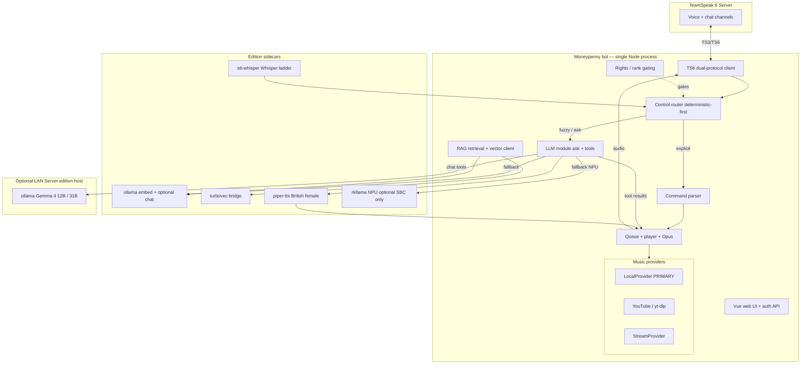

# Project Moneypenny — Design Document (v3)

> **v3 supersedes v2.** Product is **two editions from one repo**: **SBC** (Orange Pi 5 Max / RK3588) and **Server** (x86_64, ideally GPU). Same bot and HTTP contracts; different compose overlays, model defaults, and host roles. See [docs/editions.md](./docs/editions.md) and [RELEASES.md](./RELEASES.md).
>
> Base remains a **fork of `ZHANGTIANYAO1/teamspeak-music-bot`** (TypeScript, native TS6, audited auth, web UI), local-first music, in-process LLM module. Phases and security posture below still apply.

**Status:** Core live (music, rank gating, RAG, roast, radio, split-brain LLM, Whisper+Piper voice sidecars). Dual-edition packaging shipped.
**Audience:** Implementers + maintainer
**Codename:** *Moneypenny*

---

## Editions (product shape)

| | **SBC edition** | **Server edition** |
|---|---|---|
| Hardware | RK3588 arm64, 16 GB | x86_64 Linux (**AMD** first; NVIDIA untested) |
| Bot primary host | **Yes** if `--edition sbc` | **Yes** if `--edition server` |
| Role | Full bot stack on Pi; E2B offline backup | Full bot stack on x86; host Ollama + optional TS6 |
| Chat default | LAN Gemma 4 **12B** (local E2B fallback) | Host Ollama **12B**; **31B analyst opt-in** (VRAM) |
| Embeddings | On bot host (`nomic-embed-text-v2-moe`) | On bot host (`bge-large-en-v1.5` default) |
| STT | Whisper **tiny** → **RKNN** next | **whisper.cpp Vulkan** on AMD |
| TTS | Piper `en_GB-southern_english_female-low` | Same |
| NPU | **RKNN Whisper** priority; offline chat opt-in | N/A |
| Not supported now | — | macOS / Apple Silicon |
| Compose | `docker-compose.yml` + `docker-compose.sbc.yml` | + `docker-compose.server.yml` |
| Install | `./install.sh --edition sbc` | `./install.sh --edition server` |

**Topology A (production):** SBC runs bot + TurboVec + embeddings + tiny STT; Server runs Ollama 12B/31B.  
**Topology B:** Server all-in-one (no Pi).  
**Topology C:** SBC offline-only (slow E2B or opt-in NPU).

---

## 1. Summary

Moneypenny adds two capabilities to a TeamSpeak 6 server, with **all inference under operator control** (no cloud required):

1. **Play music on request — local library first**, with YouTube and Spotify/Tidal (resolve or stream-bridge) as secondary sources.
2. **Answer questions and accept voice** via OpenAI-compatible LLMs and Whisper/Piper sidecars; natural language drives the same control router as typed commands.

Workloads are placed by edition:

| Compute | SBC (RK3588) | Server (x86) |
|---|---|---|
| **Bot + music + rights + RAG index** | Always | Always (all-in-one) or none (LLM-only host) |
| **Chat / tool-calling** | Prefer LAN 12B; E2B fallback | Local 12B (+ 31B delegate) |
| **Embeddings + TurboVec** | On-device | On-device |
| **STT** | Whisper **base** (RKNN NPU; faster-whisper CPU fallback) | Whisper **medium** (Vulkan on AMD; large-v3 optional) |
| **TTS** | Piper British female | Piper British female |
| **NPU** | **Whisper base** STT (RKNN); offline LLM opt-in only | — |

---

## 2. Goals & Non-Goals

### Goals
- **One repo, two editions**, `docker compose` deploy, documented host prep (NPU only when used).
- **Local music is the primary source.** YouTube secondary; Spotify/Tidal via resolve or stream-bridge.
- Deterministic commands first; LLM tool-calling for fuzzy intent (§9). Rights enforced in the executor, never by the model.
- Voice loop via **Whisper ladder + Piper** HTTP sidecars ([docs/voice-backends.md](./docs/voice-backends.md)).
- Rank gating mapped to TeamSpeak server-groups (§8).
- All inference local/LAN; no external API keys for core function.
- Split-brain LLM: chat URL ≠ embedding URL ([docs/remote-llm.md](./docs/remote-llm.md)).

### Non-Goals
- Multi-tenant SaaS.
- Reimplementing TeamSpeak moderation.
- Native DRM Spotify/Tidal inside the bot process.
- Day-to-day chat LLM on the RK3588 NPU (decode is memory-bandwidth-bound; NPU is for offline fallback / future STT).
- English-word → command mishear tables for STT (no keyword alias maps).

---

## 3. Target Environment

### SBC edition
- **Board:** Orange Pi 5 Max, RK3588, 16 GB.
- **OS:** Ubuntu 24.04 arm64 / Armbian / DietPi (vendor 6.1 kernel).
- **NPU stack (optional):** RKNPU **v0.9.8**, `librkllmrt` **1.2.x–1.3.x** — only for `--llm npu` offline path (§14).
- **Cooling:** Active cooling required when voice + embed + music run together.

### Server edition
- **CPU:** x86_64 Linux, 32 GB+ RAM recommended for 12B QAT.
- **GPU:** **AMD** preferred (host Ollama ROCm + whisper.cpp Vulkan). NVIDIA paths untested.
- **OS:** Docker-capable Linux with Compose v2. **macOS out of scope** for now.

### Shared
- **Runtimes:** Docker + Compose v2; Node 20+ in the bot image; FFmpeg + yt-dlp in-image.
- **Storage:** Music library + models on fast disk (NVMe preferred on SBC).
- **Existing infra:** TS6 may already run elsewhere; compose `server` profile is optional.

### Default ports

| Service | Port | Proto | Notes |
|---|---|---|---|
| TS6 voice | 9987 | UDP | network-facing |
| TS6 file transfer | 30033 | TCP | network-facing |
| TS6 web query | 10080 | TCP | |
| TS6 SSH query | 10022 | TCP | |
| Bot web UI / API | 3000 | TCP | **localhost or LAN-only; see §11** |
| Ollama | 11434 | TCP | localhost; LAN only if split-brain |
| rkllama (optional NPU) | 8080 | TCP | localhost |
| stt-whisper | 9000 | TCP | localhost |
| piper-tts | 8880 | TCP | localhost |
| TurboVec (turbovec-bridge) | 6333 | TCP | internal compose network |

Only TS6 (and intentionally firewalled LLM ports for split-brain) face the network.

---

## 4. Architecture



### Control architecture (how the bot is driven)
Voice and the LLM are **layers, not rival controllers.** Speech → STT → text; text (typed or transcribed) enters one **router**:

1. **Deterministic first.** Explicit intent (`skip`, `pause`, `play <title>`, `vol 50`) matches a command/grammar and calls the queue functions directly. Fast, reliable, no NPU time.
2. **LLM fallback for fuzzy intent.** On a miss that looks like a music request ("something chill", "90s rock"), hand to the LLM with a **minimal tool schema**; it emits `play_music`/`skip`/etc., and the executor calls the *same* queue/provider functions.
3. **Otherwise `!ask`** → LLM Q&A (text now; spoken in Phase 2).

Design rule: **never put the model between a user and the skip button.** Core transport control stays deterministic; the LLM adds natural-language convenience and Q&A.

---

## 5. Base Project & License Posture

- **Base:** fork of `ZHANGTIANYAO1/teamspeak-music-bot` — **MIT**. Chosen for: native TS3/TS6 dual-protocol client, a security-reviewed auth stack (bcrypt-12, hashed session tokens, CSRF, rate limiting, WS upgrade auth), a Vue web UI, a clean `MusicProvider` interface, and TypeScript in-process LLM integration (§10).
- **License rule (non-negotiable):** TS3AudioBot is **OSL-3.0** and Bettehem is **GPL-3.0** — both reciprocal and **incompatible with copying source into an MIT project**. We **reimplement their patterns/algorithms in TypeScript**; we never copy their code. Ideas and functionality aren't copyrightable; specific code expression is. (Not legal advice; the license texts are unambiguous on reciprocity.)

---

## 6. Component Inventory

| Layer | Project / approach | Role | License | Notes |
|---|---|---|---|---|
| Voice server | TeamSpeak 6 Server | voice + chat | Proprietary, free ≤32 slots | optional compose profile |
| Bot base | fork of `teamspeak-music-bot` | TS6 client, queue, web UI, auth | MIT | our fork |
| LLM (primary) | Ollama OpenAI `/v1` | chat + tools; 12B server / E2B SBC | MIT | edition defaults differ |
| LLM (SBC opt) | rkllama + `.rkllm` | offline NPU chat fallback | OSS | not day-to-day |
| Embeddings | ollama `nomic-embed-text-v2-moe` / `bge-large-en-v1.5` | RAG vectors | — | SBC / Server; see docs/rag-embeddings.md |
| Vector DB | TurboVec bridge | doc chunks | MIT (bridge) + TurboQuant | profile `rag`; Qdrant-shaped REST |
| Music: local | **LocalProvider** | index + play local library | our code | primary (§7) |
| Music: youtube | YouTube provider | yt-dlp | MIT | `execFile` |
| Music: stream | **StreamProvider** | HTTP/Icecast + optional Tidal bridge | our code | §7 |
| STT | **Whisper** via `stt-whisper` | ASR ladder tiny→large-v3 | MIT (faster-whisper) | canonical; sherpa = legacy |
| TTS | **Piper** via `piper-tts` | British female speech | MIT | `en_GB-southern_english_female-low` |
| Pattern source (reimplement only) | TS3AudioBot | local-first + rights | OSL-3.0 | **patterns, not code** |
| Pattern source (reimplement only) | Bettehem ts3-musicbot | stream-bridge concept | GPL-3.0 | **concept, not code** |

### 6.1 De-Sinicization — complete strip list (MANDATORY)

Every Chinese-service system is removed. Note: the runtime codebase (bot/src + bot/web/src) now contains **zero Chinese-language text** after the full American English sweep (CJK count = 0 in all user-facing strings, errors, help text, profile sync, API responses, tests, and UI). Historical design docs retain some original notes. This completes both the functional de-sinicization (§6.1) and the explicit language mandate. But the provider plumbing is threaded through ~22 files, so a clean removal is more than deleting three files:

**Delete outright:**
- Provider implementations + tests: `src/music/netease.ts`, `qq.ts`, `bilibili.ts` (and their `*.test.ts`).
- The embedded API proxy: `src/music/api-server.ts` (spins up local NetEase + QQ API servers) and its startup wiring in `src/index.ts`.

**Remove dependencies (`package.json`):**
- `NeteaseCloudMusicApi`, `@sansenjian/qq-music-api`.
- The **koa stack** pulled in *only* to host the NetEase API: `koa`, `@koa/router`, `koa-bodyparser`, `koa-static` (the real web server is express — verify no other importer before removing). Update the package `description` string ("…NetEase Cloud Music and QQ Music support").

**Edit the plumbing (these reference the removed platforms):**
- `src/music/provider.ts`: change the `platform` union from `"netease" | "qq" | "bilibili" | "youtube"` to `"local" | "youtube" | "stream"`. Fix every call site the type change surfaces: `src/web/api/music.ts`, `src/web/api/player.ts`, `src/bot/{manager,instance,profile}.ts`, `src/audio/{player,queue}.ts`, `src/data/config.ts`.
- `src/data/config.ts`: remove `neteasePort` / `qqMusicPort` and related config.
- `src/music/auth.ts`: drop the `netease | qq | bilibili` cookie platforms (the cookie store is only needed for those services; the new providers don't use it — likely delete the module).
- Frontend (`web/src/`): remove netease/qq/bilibili options from `views/Settings.vue`, `views/Search.vue`, `views/Home.vue`, `components/SongCard.vue`, `stores/player.ts`, `stores/sourceTabs.ts`. The source-tabs become **Local / YouTube / Stream**.

**Acceptance:** `grep -riE "netease|qqmusic|bilibili|163\.com|\.qq\.com" src web/src` returns nothing; `npm ls` shows no `NeteaseCloudMusicApi` / `qq-music-api` / koa; build + tests pass with the new three-provider lineup.

### 6.2 The one dependency you can't just delete — and what to do about it

`@honeybbq/teamspeak-client` (and `ts3-nodejs-library`, used for ServerQuery) is the **TS3/TS6 protocol implementation** — it is the entire reason this fork has native TS6 support, so removing it means abandoning the advantage we chose this base for. It is **not** a "Chinese music service," but its maintainer provenance can't be verified from the package name, so treat it like any third-party native-protocol dependency handling credentials and network:
- **Pin** the exact version (no `^` float).
- **Review** the published source for telemetry / unexpected outbound connections (it speaks a binary protocol to *your* TS server only; flag anything else).
- **Vendor it** into the repo (copy the source under `bot/vendor/`, build from it) so you control updates and can audit/patch — this also insulates you from a single-maintainer upstream going away.
- Add an `.npmrc` pinning the **official npm registry** (the audit found no mirror override, which is correct — keep it that way) and commit the lockfile.

---

## 7. Music Provider Layer (the local-first rework)

The fork's `MusicProvider` interface stays; the provider lineup changes to **Local (primary) + YouTube + Stream**.

### 7.1 LocalProvider (new, primary) — patterns reimplemented from TS3AudioBot
- **Library indexing by tags:** walk a configured music directory; read embedded metadata (title/artist/album/cover) with the **`music-metadata`** npm package (do **not** port TS3AudioBot's `AudioTagReader`). Build a searchable index; extract cover art for the UI.
- **Local playlists:** parse **M3U/M3U8** (reimplement TS3AudioBot's `M3uReader` idea in TS, or a small npm). Local playlists are first-class.
- **Path-traversal guard — and fix what they flagged:** resolve any requested file against the music-dir prefix and confirm it stays inside it — TS3AudioBot's pattern is `GetFullPath(prefix)` + `fullPath.StartsWith(prefix)`. In TS: `path.resolve` + prefix check **plus a symlink-escape check** (`fs.realpath` then re-verify the prefix). Note TS3AudioBot's own `// TODO rework for security` on its directory-playlist path — **do that part correctly here**, since local files are now the primary attack surface.

### 7.2 YouTube provider — keep
The existing provider already shells out via `execFile` (no shell, no injection). Keep as-is; it covers yt-dlp's many sites.

### 7.3 StreamProvider (new) — Spotify/Tidal bridge
Plays an arbitrary HTTP/Icecast URL (TS3AudioBot proves stream playback works). Any external player becomes a source:
- **Spotify:** librespot/ncspot exposes a local stream (Premium required). Use the **Bettehem approach** conceptually — Spotify Web API for accurate metadata/resolution, real audio via librespot — *reimplemented*, not copied (GPL).
- **Tidal:** a Tidal-capable player/tool exposed as a stream. No native bot support exists anywhere (DRM); the stream bridge is the only clean path.

### 7.4 Unified resolution (pattern from TS3AudioBot)
Add a `resolve(input)` entry point using a **certainty-based match** (Always / Maybe / Never) so a raw `play <anything>` routes correctly: local path → LocalProvider; recognizable URL → YouTube/Stream; otherwise → search (Local first, then YouTube).

---

## 8. Permissions / Rank Gating (pattern from TS3AudioBot)

Replace the base's flat `PUBLIC_COMMANDS` / `ADMIN_COMMANDS` sets with a **declarative, group-aware rights model** reimplemented from TS3AudioBot's `Rights` system (rules matching on client UID / **server-group** / channel-group → permitted commands). Map rules to the existing **military-rank TeamSpeak server-groups** so command access follows the hierarchy (e.g. senior ranks may `stop`/`clear`/`move`, members may `add`/`vote`). Config-driven, hot-reloadable.

---

## 9. LLM Integration (in-process)

- **Module:** a new TypeScript module in the fork (not a separate process). Uses the already-present `axios` to call RKLLama's **OpenAI-compatible** `/v1/chat/completions`.
- **Seam:** extend the existing command dispatcher — add `ask` to the command set and register the router from §4. Inbound chat already arrives as typed `textMessage` events; replies go via the existing `sendTextMessage`.
- **Control routing (the §4 rule):** deterministic command match first; LLM tool-calling only for fuzzy music intent; `!ask` for Q&A.
- **Tool schema (keep minimal — small model):** `play_music(query)`, `queue(query)`, `skip()`, `pause()`, `resume()`, `set_volume(n)`, `stop()`, `now_playing()`. Executors call the **same** queue/provider functions the deterministic path uses — no IPC, shared typed state.
- **System prompt:** terse answers (NPU throughput), bot persona, explicit "prefer a tool call for music actions; answer briefly otherwise."
- **Context budget:** RKLLM `max_context` ≈ 2048 tokens — cap per-channel history; summarize/evict on overflow.
- **Model choice:** Qwen3-1.7B for latency; Qwen3-4B if tool-calling reliability needs it and latency allows. **Do not** use DeepSeek-R1 distills (broken on NPU) — CPU/Ollama only if ever needed.

---

## 10. Voice Pipeline (Phase 2)

- **STT + VAD:** sherpa-onnx on CPU. Circular-buffer + VAD end-pointing (KokoDOS pattern) on the bot's inbound channel audio. Transcript → the same control router (§4) — simple commands matched deterministically, fuzzy ones to the LLM.
- **TTS:** Kokoro-FastAPI on CPU (quality) or RKLLama's Piper on NPU (one fewer service). Output → queue → played through the client.
- **Inbound capture:** `@honeybbq/teamspeak-client` emits per-speaker `voiceData` (wired via `TS3Client`); Opus→PCM decode runs in `bot/src/bot/voice/session.ts` with hardened packet splitting (`bot/src/audio/opus-voice.ts`). Round-trip latency and live TS6 codec edge cases still need operator validation on hardware.

---

## 10A. Recommended Models (for the 16 GB OPi5 Max)

**Framing first: on this board, RAM is not the bottleneck — NPU throughput and CPU headroom are.** All the models below are tiny next to 16 GB (the LLM ~2–5 GB, STT/TTS well under 1 GB each), so model choice is driven by *latency and quality*, not fitting memory. The NPU runs one LLM at a time; loading a model takes seconds, so do **not** try to hot-swap two LLMs per request — pick one. RK3588 LLM inference is **W8A8** (the safe, reliable quant on this chip; some models also convert to w4a16, but default to W8A8).

### LLM (on the NPU, via RKLLama)
- **Default / recommended: `Qwen3-1.7B-Instruct` (W8A8).** The validated sweet spot — ~13.6 tok/s on RK3588 with RKLLM 1.2.3, reliable tool/function-calling (which the control router depends on), and `<think>` reasoning tags. Fast enough that voice round-trips stay tolerable. **Start here.**
- **Quality upgrade: `Qwen3-4B-Instruct` (W8A8).** Noticeably better tool-calling reliability and answer quality; expect roughly half the tok/s (interactive for `!ask`, borderline for low-latency voice). Move to this only if 1.7B's tool-calls or answers prove too weak — don't run both.
- **Viable alternatives:** `Llama-3.2-3B-Instruct` (solid tool-calling), `Gemma3-4B` (strong instruction-following; convert W8A8), `Phi-4-mini` (good reasoning for size). All RKLLM-supported. Qwen3 is the safest given the validated RK3588 numbers *and* RKLLama's tool-calling support is best-tested on Qwen.
- **Avoid:** DeepSeek-R1 distills (produce garbage on RKLLM 1.2.3 — known bug); anything >4B for interactive use (too slow on a 6-TOPS NPU).

### STT (dual-track Whisper)
- **SBC (product default):** Whisper **base** on the **NPU** via RKNN (`stt-rknn`). Chat stays on LAN 12B / E2B CPU so NPU ASR does not fight an NPU LLM. CPU **faster-whisper** is fallback only when `.rknn` weights are missing.
- **Server:** whisper.cpp **medium** (Vulkan on AMD preferred).
- Zoo RKNN ladder: tiny / base / medium only (no Rockchip `small`). See [docs/voice-backends.md](./docs/voice-backends.md).

### TTS
- **Canonical: Piper** `en_GB-southern_english_female-low` via HTTP sidecar (`piper-tts`).

### Putting it on the silicon (SBC)
NPU → Whisper base (RKNN STT). CPU → bot + music + Piper TTS + ollama E2B/embed + TurboVec. Chat LLM usually on LAN Server. Optional NPU LLM (`rkllama`) only for offline opt-in.

---

## 11. Security Hardening (from the source audit of the base)

The base's code is solid (no shell-exec injection; full `/api` auth + CSRF + rate-limit; WS upgrade auth; bcrypt-12; session tokens stored only as SHA-256; parameterized SQL). The work was in **deployment defaults** and **deps** — now largely wired (see `docs/hardening.md`):

- [x] **Run as non-root.** `bot/Dockerfile` is a real multi-stage build (was a placeholder that never built the app); slim runtime runs as the unprivileged `moneypenny` uid 1000.
- [x] **Read-only root fs + least privilege.** Compose bot service: `read_only: true`, `cap_drop: [ALL]`, `no-new-privileges`, scratch on `tmpfs`. All mutable state — incl. `config.json`, now relocated under `data/` — lives on the single writable `/app/data` volume.
- [x] **No host networking; localhost-only by default.** Bridge network; published as `127.0.0.1:3000:3000`. App binds `BIND_ADDRESS` (default `127.0.0.1` bare-metal; `0.0.0.0` inside the container with host-side restriction). Binding `0.0.0.0` logs a warning. UFW recipe for LAN reach in `docs/hardening.md`.
- [x] **HTTPS-aware cookies.** Session cookie already `httpOnly` + `SameSite=Lax` + `Secure` under HTTPS; `trustProxy` honors `X-Forwarded-Proto` behind a TLS proxy.
- [x] **Healthcheck + watchdog** (`/api/health`; memory ceiling → exit → Docker restart).
- **First-run on a trusted binding** (admin = first account) and **`npm audit`** of the `ws` / `@discordjs/opus → node-pre-gyp → tar` chains remain **operator steps** (documented).
- **Secrets at rest are plaintext** (TS password, config; SQLite/files) — `data/` is `chmod 700`, owned by uid 1000; protect perms + backups (documented).

---

## 12. Repository Layout

```
moneypenny/
├─ README.md / DESIGN.md / LICENSE (MIT)
├─ docker-compose.yml            # profiles: server, core, voice
├─ .env.example / Makefile
├─ host-setup/                   # NPU driver 0.9.8 + runtime 1.2.x; check-npu.sh
├─ models/convert/               # x86-only Qwen3 -> .rkllm (W8A8) conversion
├─ bot/                          # the FORK (TypeScript)
│  ├─ src/
│  │  ├─ packages/ts6-client/    # @moneypenny/ts6-client (TS3/TS6; public barrel)
│  │  ├─ http/                   # createWebServer + Express plugins (PR-C1)
│  │  ├─ web/                    # domain API routers + middleware + Vue SPA
│  │  ├─ bot/commands.ts         # extend: add `ask`, wire control router (§4)
│  │  ├─ control/router.ts       # NEW: deterministic-first dispatch
│  │  ├─ llm/                    # NEW: RKLLama client + tool schema/executors (§9)
│  │  ├─ rights/                 # NEW: rank-gating rules (§8)
│  │  ├─ music/
│  │  │  ├─ local.ts             # NEW: LocalProvider (§7.1)
│  │  │  ├─ stream.ts            # NEW: StreamProvider (§7.3)
│  │  │  ├─ youtube.ts           # KEEP
│  │  │  └─ (netease/qq/bilibili REMOVED)
│  │  └─ audio/                  # inherited queue/player/encoder
│  └─ Dockerfile                 # add non-root USER (§11)
├─ services/
│  ├─ teamspeak/                 # TS6 server compose (optional profile)
│  └─ rkllama/                   # NPU passthrough + Qwen3 config
├─ voice/                        # Phase 2: stt (sherpa-onnx), tts (kokoro), capture/
├─ scripts/                      # smoke-phase0/1, healthcheck
└─ docs/                         # runbook, model-conversion, troubleshooting
```

---

## 13. Build Plan (phased, with acceptance criteria)

**Phase 0 — Validate riskiest assumption.** Fork builds and runs; its TS6 client connects to the TS6 server and plays a test track. *Accept:* bot visible in channel, plays audio.
- [x] Strong support — auto bot creation + loud success banners + helper script. Very easy to validate against a real TS6 (maintainer has a LAN server). Ready to execute.

**Phase 1a — Local-first music.** Implement `LocalProvider` (index/tags/M3U/path-guard), keep YouTube, delete CN providers, add certainty-based `resolve`. *Accept:* `!play <local title>` and `!play <youtube>` both work; library searchable in UI; path-guard rejects `../` and symlink escapes (tested).
- [x] **Phase 1a COMPLETE** — Backend (strong LocalProvider + resolve + M3U + guard), UI modernization + Local primary, full American English zero-CJK sweep, path-guard tests added + passing. Router integration done earlier.

**Phase 1b — LLM Q&A + tool control.** Host NPU prep green; RKLLama serves Qwen3; in-process LLM module wired through the control router; minimal tool schema mapped to queue functions. *Accept:* `!ask` answers in a few seconds; "play something chill" results in a tool call that queues music; explicit `skip`/`pause` never touch the model.
- [x] **Wiring complete (text path)** — `bot/src/llm/` (client + minimal tool schema + system prompt + chatForIntent) is now wired through the ControlRouter:
  - `!ask <q>` → LLM Q&A (no tools).
  - A prefixed input whose name is **not** a known command → LLM tool-calling for fuzzy music intent; tool calls are mapped to synthetic deterministic commands and run through the **same** resolve+execute path the `!`-commands use (shared executors, no IPC — §9). Non-prefixed chat is ignored (no spam); fuzzy intent must opt in via the prefix.
  - Deterministic commands (incl. `skip`/`pause`) still match first and never touch the model (§4 rule preserved); the audio-connection guard also applies to LLM-driven playback.
  - Gated by `config.llmEnabled` (default off) so an absent/down RKLLama never stalls command handling; `llmUrl`/`llmModel` override the client. Aliases now thread through `route()`.
  - **Context budget (§9) done** — `bot/src/llm/history.ts` `ConversationStore`: per-conversation history keyed per-user for DMs and a shared key for channel chat (`conversationKey()` in instance.ts), with a token-budget cap (~1024 tokens default, ~4 chars/token estimate) that evicts oldest turns on overflow; always retains the latest turn. Both `ask` and `chatForIntent` carry+record history; tool-only replies are stored as a compact `[called play_music(...)]` summary so follow-ups have context. Summarization-on-evict left as a future refinement.
  - Tests: `bot/src/control/router.test.ts`, `bot/src/llm/history.test.ts`, `bot/src/llm/index.test.ts`.
  - **Remaining for Phase 1b:** live validation against a real RKLLama/Qwen3 (acceptance criteria need NPU hardware).

**Phase 1c — Rank gating.** Rights rules mapped to TS server-groups. *Accept:* command access follows rank; denied commands return a clear message.
- [x] **Complete** — `bot/src/rights/` `RightsEngine`: declarative, group-aware rules (match on UID or server-group → allow/deny command tokens, `@group` expansion, `*` wildcard, ordered later-overrides-earlier, `superAdminUids` bypass), reimplemented in spirit from TS3AudioBot's Rights (no source copied). `defaultRightsConfig(adminGroups)` preserves the legacy public/admin split. Wired into the ControlRouter via `RouterContext.canRun`, enforced in `executeDeterministic` so it gates **both** typed commands and LLM-tool-derived commands (no escalation via natural language) plus `!ask`. Subject resolved from `getClientsInChannel()` (`ClientInfo.serverGroups`), with **TS6 HTTP Query enrichment** when the full client omits groups (`bot/src/bot/rights/subject.ts`); lookup failure → lowest privilege (never grants on error). Gated by `config.rightsEnabled` (default **on**); hot-reloadable via `BotInstance.updateRights()` / `RightsEngine.reload()`. Production military-rank template: `scripts/rights-rank-gating.json` (`docs/rank-gating.md`). Tests in `bot/src/rights/index.test.ts` + router gating tests. **Settings UI done** — admin "AI & Permissions" panel toggles LLM + rank gating; advanced **rights rules JSON editor** + rights debugger via `GET`/`POST /api/bot/settings`. **Remaining:** file-watch hot-reload for rights JSON on disk.

**Phase 2 — Voice.** VAD/STT capture → router; TTS replies. *Accept:* spoken question → spoken answer; spoken "skip" skips; round-trip latency documented.
- [x] **Pipeline scaffolded + wired (text-validated)** — `bot/src/voice/`:
  - `vad.ts` `SilenceSegmenter` — dependency-free RMS-energy end-pointer (onset drop, hangover, min-speech, max-utterance force-flush); model-free so fully unit-tested; swappable for Silero behind the same `push()/flush()`.
  - `stt.ts` `SherpaSttClient` + `tts.ts` `KokoroTtsClient` — HTTP clients (sherpa-onnx sidecar / Kokoro-FastAPI OpenAI-compatible) behind `SttProvider`/`TtsProvider` interfaces.
  - `pipeline.ts` `VoicePipeline` — STT → **`ControlRouter.routeVoice`** → execute → optional TTS reply. Reuses the chat router so voice inherits deterministic-first dispatch, LLM fuzzy-intent/Q&A, **and rank gating** (no separate voice command path). Degrades gracefully on STT/TTS failure.
  - `ControlRouter.routeVoice()` — prefix-less: first word a known command → deterministic (spoken "skip"/"pause" never touch the model); else → LLM intent (covers fuzzy music control *and* spoken Q&A).
  - Inbound capture wired: `@honeybbq/teamspeak-client` **does** emit per-speaker `voiceData` (re-emitted by `TS3Client`); `BotInstance` decodes Opus→PCM (48 kHz stereo), end-points per speaker, resolves the speaker's server-groups (channel client list + TS6 HTTP Query fallback) for rank gating, and plays TTS replies through the `AudioPlayer`. Gated by `config.voice.enabled` (default off).
  - Tests: `bot/src/voice/vad.test.ts`, `bot/src/voice/pipeline.test.ts`, router voice-routing tests.
  - **Remaining / needs hardware:** live TS6 round-trip latency on the RK3588; STT/TTS sidecar tuning on the Pi. **Shipped:** Opus decode hardening (`opus-packet.ts`/`opus-voice.ts`, `974ea1d`); volume duck during STT via `AudioPlayer.duckForStt()`/`restoreFromSttDuck()` (not hard-pause); Settings voice panel + `updateVoice` hot-reload; spoken replies still use save-position → speak → resume (single stream, no mixer).

**Phase 3 — Polish.** StreamProvider + librespot (Spotify); watchdog (restart on OOM/NPU stall); conversation memory within budget; LLM panel in the web UI.
- [x] **StreamProvider (§7.3)** — `bot/src/music/stream.ts`: plays arbitrary http(s)/Icecast URLs directly, and resolves Spotify/Tidal refs through an optional external bridge (`GET {bridgeUrl}/resolve?uri=…` → `{streamUrl,title,…}`). Wired as the `stream` platform; bridge URL via `config.streamBridgeUrl` / `STREAM_BRIDGE_URL`. **Tidal bridge ships** (`services/tidal-bridge`, `--profile stream`); Spotify librespot sidecar remains external/operator-supplied.
- [x] **Watchdog (§13)** — `bot/src/watchdog.ts`: polls health, reconnects dropped `autoStart` bots (per-bot reconnect cooldown), and guards process RSS against `WATCHDOG_MEMORY_MB` (→ `process.exit` so Docker's restart policy recovers). Injectable clock/memory reader; wired in `index.ts`. Tests: `bot/src/watchdog.test.ts`.
- [x] **Conversation memory within budget** — delivered in Phase 1b (`bot/src/llm/history.ts`, token-budget eviction).
- [x] **LLM panel in the web UI** — admin "AI & Permissions" panel shows live LLM status (configured / reachable via `GET /api/bot/llm/status`) and a test-ask box (`POST /api/bot/llm/ask`, admin-gated). `BotInstance.getLlmStatus()/askLlm()` back it.
- **Remaining Phase 3:** Spotify librespot bridge (external; needs Premium). **Voice ducking:** volume attenuation during STT (`duckForStt`); spoken TTS replies use save-position → speak → resume (single stream). Production Docker hardening (§11) done.

---

## Current Implementation Status (updated 2026-07 — dual editions)

**Shipped and tested (797 backend unit tests, 11 frontend unit tests, 110 test files, `tsc` clean):**
- Full de-sinicization (§6.1) — CN providers, auth UI, and dead API stubs removed.
- **Phase 1a** — `LocalProvider` with path guard, M3U, `resolve()`; local-first web UI and command path.
- **Phase 1b** — `bot/src/llm/` wired through `ControlRouter` (`!ask`, fuzzy intent, tool-calling).
- **Rank gating (§8)** — `RightsEngine` + settings hot-reload + rights JSON editor + debug API.
- **StreamProvider (§7.3)** — http(s)/Icecast + bridged Spotify/Tidal refs; `services/tidal-bridge` ships (`--profile stream`).
- **RAG + doctrine (Phase 5–6)** — vector ingest/query, rank-gated retrieval, `!reindex`, four ingestion paths.
- **Memory + roast (Phase 7–8)** — `!remember`/`!recall`; institutional KG via `!kg`/`!diary`; roast capture/grading/reel.
- **Voice** — Whisper ladder (`stt-whisper`) + Piper British TTS (`piper-tts`); profiles `voice-edge` / `voice-server`; sherpa+Kokoro legacy only; no STT English-alias command maps.
- **Phase 4 split-brain** — `llmUrl` → LAN/Server Gemma 4 12B; embeddings on-device; E2B fallback; NPU rkllama offline opt-in (`docs/remote-llm.md`).
- **Dual editions** — `sbc` + `server` compose overlays, `install.sh --edition`, `scripts/package-release.sh`, `docs/editions.md`, `RELEASES.md`.
- **R1 analyst delegation** — `!analyst`/`!agent` + `delegate_to_agent` → `llmDelegateUrl`; R1b async ack + `postFollowUp`.
- **R3 org docs** — `!intsum`/`!aar` templated workflows + Pandoc docx export (`docs/r3-workflows.md`).
- **R4 client moves** — `!moveclient`, `!moveall`, NL `move_client` tools.
- **Radio mode (Phase 9)** — director/clock/bumpers/tags/analyzer shipped; Settings Radio/DJ panel + Library tag editor (`docs/radio.md`); off by default.
- **BotInstance refactor** — playback, commands, roast, memory, knowledge, LLM, radio, voice, and rights in submodules.
- **Pi deploy safeguards** — `deploy-preflight.sh`, `deploy-to-pi.sh`, `verify-pi-deploy.sh` (`AGENTS.md` §5).
- **Security posture (§11)** — non-root Docker, CSRF, rate limits, session auth; see `docs/hardening.md`.

**Remaining gaps / build list (ordered):** full list in **[docs/BUILD.md](./docs/BUILD.md)**.

- **Poke as command channel** — TS `on("poke")` → ControlRouter (queued).
- **ACE-Step music gen** — optional DJ fill; design sketch [docs/ace-step.md](./docs/ace-step.md).
- Server whisper.cpp Vulkan smoke on AMD; drop sherpa/Kokoro after dual-track stable.
- Radio live smoke on opi5; R-R6 Icecast optional; librespot; Vue E2E.
- RKNN Whisper INT8 quant (FP tiny ships); `@discordjs/opus` tar advisory.

See updated Phase checkboxes above for per-phase status.

---

## Roadmap — Post-Core Expansion

> **Gating rule:** none of this starts until Phase 0–1 are proven and Phase 2 (voice) is at least underway. These ideas are coherent with the architecture, but each expands the bot from "plays music / answers questions" into "takes privileged, network-reaching actions driven by attacker-influenceable chat." Sequence them *after* the core works. Recommended order: **R4 + R2 first** (cleanest fits, least NPU tension), then **R3** scoped-down, with **R1** as the enabler for the heavier items.

### Cross-cutting security principle (applies to everything below)
**The LLM proposes; the executor disposes.** TeamSpeak chat is attacker-influenceable text feeding a small, injectable model. Every permission/rank/allowlist check is enforced **deterministically in the executor, server-side** — never delegated to the model's judgment. Side-effecting tools (network actions, scripts, channel moves) sit behind hard rank checks + allowlists, with rate limits and audit logging. A 1.7–4B model must never be the security boundary.

### R1 — LLM escalation / delegation to a heavier agent (the enabler)
> **Status (2026-06): MVP shipped.** Fast Gemma 4 12B on the primary `llmUrl` dispatches;
> a heavy model on a separate LAN host (`llmDelegateUrl`, OpenAI-compatible Ollama) handles
> analyst tasks. See `docs/remote-llm.md` and `bot/src/llm/delegate.ts`.

Small fast model dispatches; a heavy model on a separate discrete-GPU box handles tough tasks.
Mechanism: expose a `delegate_to_agent(task, context?)` tool alongside the music/control tools;
its executor makes an HTTP call to the delegate host and relays the result.
- **Escalation is intent-driven, not self-assessed.** Don't rely on the fast model judging
  "this is too hard for me." The deterministic router pre-routes explicit `!agent`/`!analyst`
  commands before the fast model sees them; fuzzy intent can also emit `delegate_to_agent`.
  Future heavy tools (`generate_intsum`, `summarize_transcript`, `compile_report`) will route
  the same way.
- **Resolves the context wall:** long-context work (transcripts, RAG over doctrine) runs on
  the delegate box; RAG chunks are injected on the delegate path the same as `!ask`.
- **Build for failure:** core music/control must never depend on the delegate host. The tool
  fails cleanly ("analyst node offline"). **R1b shipped:** async ack + `postFollowUp` result post.
- **Endgame (phase 3+):** bidirectional MCP so the delegate can call back into bot actuators
  (play, channel moves). More moving parts; defer.
- Provider-agnostic: any OpenAI-compatible model on that host works (production: Gemma 4 31B on Ollama).

### R2 — Local-network orchestration (Home Assistant, media servers, scripts)
The cleanest architectural fit — it's what the tool layer is for. **Build the tool layer as an MCP client** so HA / media / scripts are MCP servers: decoupled, swappable, auditable. Enforcement per the security principle above. `trigger_script` is the highest-risk tool imaginable here — make it an **allowlist of specific named actions, never a generic "run arbitrary command."** Heavy orchestration belongs on the separate box (R1), not stacked on the Pi.

### R3 — Org document workflows (INTSUMs / mission logs / AARs)
> **Status (2026-07): MVP shipped.** `!intsum` / `!aar` (templated bullets → delegate LLM),
> `!analyst -s` (arbitrary reports), async ack + doctrine save (`-s`), Pandoc **docx** export
> via `GET /api/rag/doctrine/:source/export` + Library **Export** button (`bot/src/docs/export.ts`;
> `pandoc` in `bot/Dockerfile`). See `docs/r3-workflows.md`.

Appealing for the org, but the on-NPU small model + 2048-token context **cannot** do the ambitious version (full-transcript ingestion, long AARs, RAG over doctrine). Scope it: **short, templated docs where the human supplies the key points and the model fills a template** run on the Pi; route real doc generation (long context, RAG) to the heavy model via R1, with the bot as the voice front-end that drops the result in chat or shared storage. Export via Pandoc (light) over LibreOffice-headless. Rank-gate official doc generation.

### R4 — Voice-commanded channel moves (`clientmove`)
> **Status (2026-06): MVP shipped.** `!moveclient <nickname|clid> <channel>` (admin) moves
> *other* clients via TS6 HTTP Query `clientmove` (fallback: full-client API on TS3).
> Rank-gated as an admin command; sliding-window rate limit (5/min). Voice inherits
> the same path when STT transcribes a prefixed `moveclient` command (`bot/packages/ts6-client` move-resolver).

Lowest risk, doesn't touch the NPU. Moving *other* clients is a privileged admin action;
the bot's TS identity needs `i_client_move_power` granted minimally. Executor-side rank
enforcement + rate-limit on mass moves (a triggerable "move everyone" is a comms-DoS).
**Shipped (2026-06):** `move_client` / `move_all_clients` LLM tools (admin-gated at execution);
`!moveall <channel>` + `!moveall confirm` (30s, max 10 clients in channel).

### Model note (deferred, low-stakes)
Gemma 4 (E4B/E2B QAT GGUF) is a possible A/B candidate **on CPU via Ollama** — *not* an NPU swap: RKLLM supports Gemma 2/3/3n (not 4), and Gemma's QAT artifacts (Q4_0 GGUF, mobile wNa8o8) target CPU/GPU runtimes, not RKLLM's NPU path. Keep Qwen3-on-NPU as default; benchmark Gemma anytime via the OpenAI-compatible backend. A config knob, not a phase.

---

## 14. Risks & Open Questions

| Risk | Mitigation |
|---|---|
| TS6 + fork client voice compat (TS6 beta) | Phase 0 validates before any build-on-top |
| RKLLM runtime↔driver coupling | pin 1.2.x ↔ 0.9.8; `check-npu.sh` asserts |
| Small-model tool-calling reliability | deterministic-first routing; minimal tool schema; Qwen3-4B if needed |
| LocalProvider path traversal | strict prefix + symlink check; fix the gap TS3AudioBot flagged; test it |
| Inbound voice capture (Phase 2) | Per-speaker `voiceData` wired + Opus decode hardened (`opus-voice.ts`); live TS6 round-trip latency still needs operator validation |
| NPU context 2048 | cap/summarize history |
| Deployment exposure (root + host-net + HTTP) | §11 hardening checklist |
| Single-maintainer upstream (both candidates) | we own the fork; that's the plan |
| License contamination | reimplement OSL/GPL patterns; never copy source |
| Secrets at rest plaintext | protect `data/` perms + backups |

### 14.1 Threat model summary

Consolidated view of the trust boundaries and the guarantees that defend them.

| Boundary / asset | Threat | Control |
|---|---|---|
| **Privileged commands** (stop/clear/move/vol…) | a low-rank member runs them | Rank gating (§8): rules match TS server-groups; default-deny for admin commands until `adminGroups` set (fail-safe F-4). Enforced in `executeDeterministic` for **typed AND LLM-tool-derived** commands — natural language can't escalate. |
| **Rule evaluation** | a stale/loose rule grants too much | Rules are **ordered, later-overrides-earlier**; `deny`/`deny "*"` always wins within/after a rule; commands normalized to lowercase both at definition and check time. Verify any ruleset with `GET /api/bot/rights/debug?groups=105,106,107` (returns the effective chat+voice allow-sets). See `docs/rank-gating.md`. |
| **Voice vs chat surface** | a spoken command bypasses a chat-only rule | Rules carry an optional `scope: voice\|chat\|both`; the voice path is evaluated with `context:"voice"`, chat with `"chat"`. A voice-scoped grant never leaks to chat (adversarial test). |
| **Classified doctrine** (Phase 6) | an uncleared member retrieves SECRET INTSUMs | Retrieval is rank-gated: a chunk's `classification` maps to a `doctrine:<level>` permission; the vector query filters to the invoker's cleared levels. Unauthorized members only ever get `unclassified`. |
| **Subject resolution** | spoofing / lookup failure grants access | Subject resolved live from `getClientsInChannel()`; voice re-resolves by client id at utterance time (audit F-5); any miss/error → lowest privilege (never grants on error). |
| **Web UI / API** | LAN/remote access to admin actions | Bind localhost or LAN-only (§11); admin routes behind `requireAdmin`; CSRF origin check; bcrypt creds; read-only container rootfs. |
| **`!ask` / LLM** | prompt-driven privilege escalation or data exfil | The LLM only emits tool calls that re-enter the **same gated** deterministic path; doctrine context is pre-filtered by clearance before it reaches the model. |

**Not in scope / accepted:** a compromised TS server (the bot trusts its server-group data); a malicious admin (full trust by design); downloaded YouTube media (user's ToS call).

---

## 15. Appendix — References
ZHANGTIANYAO1/teamspeak-music-bot (base, MIT) · TS3AudioBot (OSL-3.0, patterns only) · Bettehem/ts3-musicbot (GPL-3.0, concept only) · RKLLama / airockchip rknn-llm · Qwen3 · sherpa-onnx · Kokoro-82M / Kokoro-FastAPI · librespot/ncspot · KokoDOS / dnhkng GLaDOS · yt-dlp · music-metadata (npm).

*Pins (fill `.env`): RKNPU 0.9.8 · RKLLM 1.2.3 · TS6 beta 6.0.0-beta3.x · Qwen3-1.7B W8A8 · Node 20+.*
