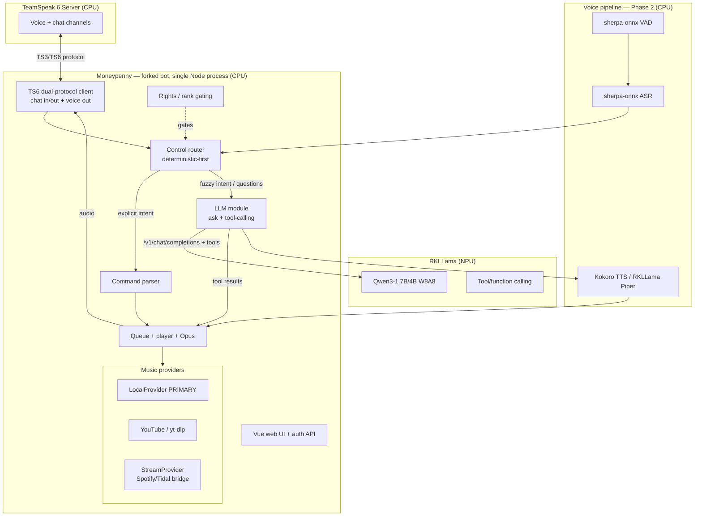

# Project Moneypenny — Design Document (v2)

> **Implementation Status Note:** See the "Current Implementation Status" section (added during active development) and the checkmarked phases below for what has been built vs. remaining gaps.

> A self-hosted, NPU-accelerated **AI + music assistant** for a **TeamSpeak 6** server, running entirely on a single **Orange Pi 5 Max (RK3588, 16 GB)**. One repo, one `docker compose up`, no cloud.
>
> **v2 supersedes v1.** The big change: the audio bot is no longer TS3AudioBot. The base is now a **fork of `ZHANGTIANYAO1/teamspeak-music-bot`** (TypeScript, native TS6, audited auth, web UI), with its music layer reworked to be **local-first** and an **in-process LLM module** added. Rationale captured in §5 and §10.

**Status:** Design / pre-implementation
**Audience:** Claude Code (implementer) + maintainer
**Codename:** *Moneypenny* (placeholder)

---

## 1. Summary

Moneypenny adds two capabilities to an existing TeamSpeak 6 server, both running locally on one RK3588 board:

1. **Play music on request — local library first**, with YouTube and (later) Spotify/Tidal as secondary sources.
2. **Answer questions** (and, in Phase 2, accept voice) via a local LLM on the NPU, which can also drive music by natural language.

Central design idea — assign each workload to the silicon it suits, so they don't contend:

| Compute unit | Job |
|---|---|
| **NPU** (6 TOPS, 3 cores) | LLM inference (Qwen3 via RKLLama); optionally TTS (Piper) |
| **CPU** (4× Cortex-A76) | The bot (Node), TS6 server, `LocalProvider` indexing, `yt-dlp`/`ffmpeg`, STT/VAD, Kokoro TTS |
| **GPU** (Mali-G610) | Idle by default; reserved as an alternate LLM backend (MLC-LLM) |

---

## 2. Goals & Non-Goals

### Goals
- Single repo, `docker compose` deploy, with a documented host NPU-driver prep step.
- **Local music is the primary source.** YouTube secondary; Spotify/Tidal via a stream-bridge, third.
- Phase 1: `!play` (local + YouTube), full queue control, and `!ask` → LLM text answer.
- Natural-language music control via LLM tool-calling, *layered on top of* deterministic commands (see §9).
- Phase 2: voice loop — speak in channel, get spoken answers; voice drives the same control router.
- Permissions mapped to the existing TeamSpeak rank hierarchy (§8).
- All inference local; no external keys required for core function.

### Non-Goals
- Multi-server / multi-tenant.
- Reimplementing TeamSpeak moderation (we integrate with its server-groups).
- Native Tidal/Spotify support inside the bot (handled by external players exposed as streams).
- Models larger than the board serves at usable speed.

---

## 3. Target Environment

- **Board:** Orange Pi 5 Max, RK3588, 16 GB.
- **OS:** Ubuntu 24.04 arm64 / Armbian (vendor 6.1 kernel).
- **NPU stack:** RKNPU driver **v0.9.8**, `librkllmrt` **1.2.x** (1.2.3 known-good). Versions are coupled — see §14.
- **Runtimes:** Docker + Compose v2; Node 20+ (the fork); FFmpeg + yt-dlp (system).
- **Storage:** Models + music library on NVMe (cold-load time is I/O-bound).
- **Cooling:** Active cooling **required** (Phase 2 lights up NPU + CPU together).
- **Existing infra:** TS6 already runs in Docker behind the host firewall (UFW) with upstream port-forwarding. Adopt it or stand up a new instance via compose profile.

### Default ports

| Service | Port | Proto | Notes |
|---|---|---|---|
| TS6 voice | 9987 | UDP | network-facing |
| TS6 file transfer | 30033 | TCP | network-facing |
| TS6 web query | 10080 | TCP | |
| TS6 SSH query | 10022 | TCP | TS6 replaced legacy raw 10011 |
| Bot web UI / API | 3000 | TCP | **bind localhost or LAN-only; see §11** |
| RKLLama (LLM + opt TTS) | 8080 | TCP | OpenAI-compatible; internal |
| Kokoro-FastAPI (P2 TTS) | 8880 | TCP | OpenAI-compatible; internal |
| sherpa-onnx (P2 STT) | internal | — | in-process or local socket |

Only the TS6 ports face the network.

---

## 4. Architecture



### Control architecture (how the bot is driven)
Voice and the LLM are **layers, not rival controllers.** Speech → STT → text; text (typed or transcribed) enters one **router**:

1. **Deterministic first.** Explicit intent (`skip`, `pause`, `play <title>`, `vol 50`) matches a command/grammar and calls the queue functions directly. Fast, reliable, no NPU time.
2. **LLM fallback for fuzzy intent.** On a miss that looks like a music request ("something chill", "90s rock"), hand to the LLM with a **minimal tool schema**; it emits `play_music`/`skip`/etc., and the executor calls the *same* queue/provider functions.
3. **Otherwise `!ask`** → LLM Q&A (text now; spoken in Phase 2).

Design rule: **never put the model between a user and the skip button.** Core transport control stays deterministic; the LLM adds natural-language convenience and Q&A.

---

## 5. Base Project & License Posture

- **Base:** fork of `ZHANGTIANYAO1/teamspeak-music-bot` — **MIT**. Chosen for: native TS3/TS6 dual-protocol client, a security-reviewed auth stack (bcrypt-12, hashed session tokens, CSRF, rate limiting, WS upgrade auth), a Vue web UI, a clean `MusicProvider` interface, and TypeScript in-process LLM integration (§10).
- **License rule (non-negotiable):** TS3AudioBot is **OSL-3.0** and Bettehem is **GPL-3.0** — both reciprocal and **incompatible with copying source into an MIT project**. We **reimplement their patterns/algorithms in TypeScript**; we never copy their code. Ideas and functionality aren't copyrightable; specific code expression is. (Not legal advice; the license texts are unambiguous on reciprocity.)

---

## 6. Component Inventory

| Layer | Project / approach | Role | License | Notes |
|---|---|---|---|---|
| Voice server | TeamSpeak 6 Server (official beta) | voice + chat | Proprietary, free ≤32 slots | TS6 still beta; validate first |
| Bot base | fork of `teamspeak-music-bot` | TS6 client, queue, web UI, auth | MIT | our fork; first-party changes below |
| LLM serving | RKLLama (`NotPunchnox/rkllama`) | OpenAI API over RKLLM on NPU; tools; opt TTS | OSS | primary LLM backend |
| LLM model | Qwen3-1.7B (W8A8 `.rkllm`); opt 4B | brains + tool-calling | Apache-2.0 | ~13.6 tok/s @1.7B; `<think>` support |
| Music: local | **LocalProvider** (new) | index + play local library | our code | primary source (§7) |
| Music: youtube | existing YouTube provider (keep) | yt-dlp resolution | inherited MIT | already uses `execFile` safely |
| Music: stream | **StreamProvider** (new) | play arbitrary HTTP/Icecast stream | our code | Spotify/Tidal bridge (§7) |
| STT + VAD (P2) | sherpa-onnx | ASR + VAD, one ONNX toolkit | OSS | CPU; ported to RK35xx |
| TTS (P2) | Kokoro-82M via Kokoro-FastAPI | high-quality TTS, OpenAI API | Apache-2.0 | CPU; or RKLLama Piper on NPU |
| Pattern source (reimplement only) | TS3AudioBot | local-first + rights patterns | OSL-3.0 | **patterns, not code** |
| Pattern source (reimplement only) | Bettehem ts3-musicbot | "legit Spotify" approach | GPL-3.0 | **concept, not code** |
| Voice-loop reference | KokoDOS / dnhkng GLaDOS | VAD capture pipeline | — | reference only |

### 6.1 De-Sinicization — complete strip list (MANDATORY)

Every Chinese-service system is removed. Note: the runtime codebase (bot/src + bot/web/src) now contains **zero Chinese-language text** after the full American English sweep (CJK count = 0 in all user-facing strings, errors, help text, profile sync, API responses, tests, and UI). Historical design docs retain some original notes. This completes both the functional de-sinicization (§6.1) and the explicit language mandate. But the provider plumbing is threaded through ~22 files, so a clean removal is more than deleting three files:

**Delete outright:**
- Provider implementations + tests: `src/music/netease.ts`, `qq.ts`, `bilibili.ts` (and their `*.test.ts`).
- The embedded API proxy: `src/music/api-server.ts` (spins up local NetEase + QQ API servers) and its startup wiring in `src/index.ts`.

**Remove dependencies (`package.json`):**
- `NeteaseCloudMusicApi`, `@sansenjian/qq-music-api`.
- The **koa stack** pulled in *only* to host the NetEase API: `koa`, `@koa/router`, `koa-bodyparser`, `koa-static` (the real web server is express — verify no other importer before removing). Update the package `description` string ("…NetEase Cloud Music and QQ Music support").

**Edit the plumbing (these reference the removed platforms):**
- `src/music/provider.ts`: change the `platform` union from `"netease" | "qq" | "bilibili" | "youtube"` to `"local" | "youtube" | "stream"`. Fix every call site the type change surfaces: `src/web/api/music.ts`, `src/web/api/player.ts`, `src/bot/{manager,instance,profile}.ts`, `src/audio/{player,queue}.ts`, `src/data/config.ts`.
- `src/data/config.ts`: remove `neteasePort` / `qqMusicPort` and related config.
- `src/music/auth.ts`: drop the `netease | qq | bilibili` cookie platforms (the cookie store is only needed for those services; the new providers don't use it — likely delete the module).
- Frontend (`web/src/`): remove netease/qq/bilibili options from `views/Settings.vue`, `views/Search.vue`, `views/Home.vue`, `components/SongCard.vue`, `stores/player.ts`, `stores/sourceTabs.ts`. The source-tabs become **Local / YouTube / Stream**.

**Acceptance:** `grep -riE "netease|qqmusic|bilibili|163\.com|\.qq\.com" src web/src` returns nothing; `npm ls` shows no `NeteaseCloudMusicApi` / `qq-music-api` / koa; build + tests pass with the new three-provider lineup.

### 6.2 The one dependency you can't just delete — and what to do about it

`@honeybbq/teamspeak-client` (and `ts3-nodejs-library`, used for ServerQuery) is the **TS3/TS6 protocol implementation** — it is the entire reason this fork has native TS6 support, so removing it means abandoning the advantage we chose this base for. It is **not** a "Chinese music service," but its maintainer provenance can't be verified from the package name, so treat it like any third-party native-protocol dependency handling credentials and network:
- **Pin** the exact version (no `^` float).
- **Review** the published source for telemetry / unexpected outbound connections (it speaks a binary protocol to *your* TS server only; flag anything else).
- **Vendor it** into the repo (copy the source under `bot/vendor/`, build from it) so you control updates and can audit/patch — this also insulates you from a single-maintainer upstream going away.
- Add an `.npmrc` pinning the **official npm registry** (the audit found no mirror override, which is correct — keep it that way) and commit the lockfile.

---

## 7. Music Provider Layer (the local-first rework)

The fork's `MusicProvider` interface stays; the provider lineup changes to **Local (primary) + YouTube + Stream**.

### 7.1 LocalProvider (new, primary) — patterns reimplemented from TS3AudioBot
- **Library indexing by tags:** walk a configured music directory; read embedded metadata (title/artist/album/cover) with the **`music-metadata`** npm package (do **not** port TS3AudioBot's `AudioTagReader`). Build a searchable index; extract cover art for the UI.
- **Local playlists:** parse **M3U/M3U8** (reimplement TS3AudioBot's `M3uReader` idea in TS, or a small npm). Local playlists are first-class.
- **Path-traversal guard — and fix what they flagged:** resolve any requested file against the music-dir prefix and confirm it stays inside it — TS3AudioBot's pattern is `GetFullPath(prefix)` + `fullPath.StartsWith(prefix)`. In TS: `path.resolve` + prefix check **plus a symlink-escape check** (`fs.realpath` then re-verify the prefix). Note TS3AudioBot's own `// TODO rework for security` on its directory-playlist path — **do that part correctly here**, since local files are now the primary attack surface.

### 7.2 YouTube provider — keep
The existing provider already shells out via `execFile` (no shell, no injection). Keep as-is; it covers yt-dlp's many sites.

### 7.3 StreamProvider (new) — Spotify/Tidal bridge
Plays an arbitrary HTTP/Icecast URL (TS3AudioBot proves stream playback works). Any external player becomes a source:
- **Spotify:** librespot/ncspot exposes a local stream (Premium required). Use the **Bettehem approach** conceptually — Spotify Web API for accurate metadata/resolution, real audio via librespot — *reimplemented*, not copied (GPL).
- **Tidal:** a Tidal-capable player/tool exposed as a stream. No native bot support exists anywhere (DRM); the stream bridge is the only clean path.

### 7.4 Unified resolution (pattern from TS3AudioBot)
Add a `resolve(input)` entry point using a **certainty-based match** (Always / Maybe / Never) so a raw `play <anything>` routes correctly: local path → LocalProvider; recognizable URL → YouTube/Stream; otherwise → search (Local first, then YouTube).

---

## 8. Permissions / Rank Gating (pattern from TS3AudioBot)

Replace the base's flat `PUBLIC_COMMANDS` / `ADMIN_COMMANDS` sets with a **declarative, group-aware rights model** reimplemented from TS3AudioBot's `Rights` system (rules matching on client UID / **server-group** / channel-group → permitted commands). Map rules to the existing **military-rank TeamSpeak server-groups** so command access follows the hierarchy (e.g. senior ranks may `stop`/`clear`/`move`, members may `add`/`vote`). Config-driven, hot-reloadable.

---

## 9. LLM Integration (in-process)

- **Module:** a new TypeScript module in the fork (not a separate process). Uses the already-present `axios` to call RKLLama's **OpenAI-compatible** `/v1/chat/completions`.
- **Seam:** extend the existing command dispatcher — add `ask` to the command set and register the router from §4. Inbound chat already arrives as typed `textMessage` events; replies go via the existing `sendTextMessage`.
- **Control routing (the §4 rule):** deterministic command match first; LLM tool-calling only for fuzzy music intent; `!ask` for Q&A.
- **Tool schema (keep minimal — small model):** `play_music(query)`, `queue(query)`, `skip()`, `pause()`, `resume()`, `set_volume(n)`, `stop()`, `now_playing()`. Executors call the **same** queue/provider functions the deterministic path uses — no IPC, shared typed state.
- **System prompt:** terse answers (NPU throughput), bot persona, explicit "prefer a tool call for music actions; answer briefly otherwise."
- **Context budget:** RKLLM `max_context` ≈ 2048 tokens — cap per-channel history; summarize/evict on overflow.
- **Model choice:** Qwen3-1.7B for latency; Qwen3-4B if tool-calling reliability needs it and latency allows. **Do not** use DeepSeek-R1 distills (broken on NPU) — CPU/Ollama only if ever needed.

---

## 10. Voice Pipeline (Phase 2)

- **STT + VAD:** sherpa-onnx on CPU. Circular-buffer + VAD end-pointing (KokoDOS pattern) on the bot's inbound channel audio. Transcript → the same control router (§4) — simple commands matched deterministically, fuzzy ones to the LLM.
- **TTS:** Kokoro-FastAPI on CPU (quality) or RKLLama's Piper on NPU (one fewer service). Output → queue → played through the client.
- **Hardest unknown — inbound capture:** pulling per-user voice out of TeamSpeak is the unsolved piece. The fork's audio stack is playback-oriented and `@honeybbq/teamspeak-client`'s inbound-PCM exposure is **unverified** — prototype `voice/capture/` first. (TS3AudioBot's TSLib decodes inbound voice and may be a reference for the protocol-level approach, even though we're not using its code.)

---

## 10A. Recommended Models (for the 16 GB OPi5 Max)

**Framing first: on this board, RAM is not the bottleneck — NPU throughput and CPU headroom are.** All the models below are tiny next to 16 GB (the LLM ~2–5 GB, STT/TTS well under 1 GB each), so model choice is driven by *latency and quality*, not fitting memory. The NPU runs one LLM at a time; loading a model takes seconds, so do **not** try to hot-swap two LLMs per request — pick one. RK3588 LLM inference is **W8A8** (the safe, reliable quant on this chip; some models also convert to w4a16, but default to W8A8).

### LLM (on the NPU, via RKLLama)
- **Default / recommended: `Qwen3-1.7B-Instruct` (W8A8).** The validated sweet spot — ~13.6 tok/s on RK3588 with RKLLM 1.2.3, reliable tool/function-calling (which the control router depends on), and `<think>` reasoning tags. Fast enough that voice round-trips stay tolerable. **Start here.**
- **Quality upgrade: `Qwen3-4B-Instruct` (W8A8).** Noticeably better tool-calling reliability and answer quality; expect roughly half the tok/s (interactive for `!ask`, borderline for low-latency voice). Move to this only if 1.7B's tool-calls or answers prove too weak — don't run both.
- **Viable alternatives:** `Llama-3.2-3B-Instruct` (solid tool-calling), `Gemma3-4B` (strong instruction-following; convert W8A8), `Phi-4-mini` (good reasoning for size). All RKLLM-supported. Qwen3 is the safest given the validated RK3588 numbers *and* RKLLama's tool-calling support is best-tested on Qwen.
- **Avoid:** DeepSeek-R1 distills (produce garbage on RKLLM 1.2.3 — known bug); anything >4B for interactive use (too slow on a 6-TOPS NPU).

### STT (on the CPU — keep the NPU free for the LLM)
- **Recommended: SenseVoice-small via sherpa-onnx** — fast on the A76 cores, accurate, robust; one toolkit also gives you VAD. Good general default.
- **Lowest command latency: a Moonshine model (base/tiny.en) via sherpa-onnx** — purpose-built for short utterances, so "skip"/"play X" transcribe with minimal delay. Ideal if voice *control* responsiveness matters most.
- **Fallback:** Whisper-base.en. (useful-transformers runs Whisper tiny.en on the *NPU* at ~30× real-time, but that contends with the LLM — prefer CPU STT so the NPU stays dedicated to the model.)
- **VAD:** Silero VAD (bundled with sherpa-onnx) for the circular-buffer end-pointing in §10.

### TTS
- **Recommended (quality): `Kokoro-82M` (q8 ONNX) on the CPU**, via Kokoro-FastAPI's OpenAI-compatible endpoint. Best naturalness at small size, Apache-2.0, multiple voices.
- **Lower latency / NPU-offload: Piper** through RKLLama (ONNX encoder + RKNN decoder on the NPU). One fewer service and faster, at some loss of naturalness — use if the CPU is contended by music transcode + STT.

### Putting it on the silicon
NPU → Qwen3 (LLM). CPU → SenseVoice/Moonshine (STT) + Silero VAD + Kokoro (TTS) + ffmpeg/yt-dlp + the bot + TS6. Turn-based interaction means these don't collide within a single exchange. If CPU audio work ever starves things, the escape hatch is moving TTS to Piper-on-NPU or the LLM to MLC-on-GPU (§4).

---

## 11. Security Hardening (from the source audit of the base)

The base's code is solid (no shell-exec injection; full `/api` auth + CSRF + rate-limit; WS upgrade auth; bcrypt-12; session tokens stored only as SHA-256; parameterized SQL). The work was in **deployment defaults** and **deps** — now largely wired (see `docs/hardening.md`):

- [x] **Run as non-root.** `bot/Dockerfile` is a real multi-stage build (was a placeholder that never built the app); slim runtime runs as the unprivileged `moneypenny` uid 1000.
- [x] **Read-only root fs + least privilege.** Compose bot service: `read_only: true`, `cap_drop: [ALL]`, `no-new-privileges`, scratch on `tmpfs`. All mutable state — incl. `config.json`, now relocated under `data/` — lives on the single writable `/app/data` volume.
- [x] **No host networking; localhost-only by default.** Bridge network; published as `127.0.0.1:3000:3000`. App binds `BIND_ADDRESS` (default `127.0.0.1` bare-metal; `0.0.0.0` inside the container with host-side restriction). Binding `0.0.0.0` logs a warning. UFW recipe for LAN reach in `docs/hardening.md`.
- [x] **HTTPS-aware cookies.** Session cookie already `httpOnly` + `SameSite=Lax` + `Secure` under HTTPS; `trustProxy` honors `X-Forwarded-Proto` behind a TLS proxy.
- [x] **Healthcheck + watchdog** (`/api/health`; memory ceiling → exit → Docker restart).
- **First-run on a trusted binding** (admin = first account) and **`npm audit`** of the `ws` / `@discordjs/opus → node-pre-gyp → tar` chains remain **operator steps** (documented).
- **Secrets at rest are plaintext** (TS password, config; SQLite/files) — `data/` is `chmod 700`, owned by uid 1000; protect perms + backups (documented).

---

## 12. Repository Layout

```
moneypenny/
├─ README.md / DESIGN.md / LICENSE (MIT)
├─ docker-compose.yml            # profiles: server, core, voice
├─ .env.example / Makefile
├─ host-setup/                   # NPU driver 0.9.8 + runtime 1.2.x; check-npu.sh
├─ models/convert/               # x86-only Qwen3 -> .rkllm (W8A8) conversion
├─ bot/                          # the FORK (TypeScript)
│  ├─ src/
│  │  ├─ ts-protocol/            # inherited TS3/TS6 client (keep)
│  │  ├─ web/                    # inherited auth + Vue API (keep; harden per §11)
│  │  ├─ bot/commands.ts         # extend: add `ask`, wire control router (§4)
│  │  ├─ control/router.ts       # NEW: deterministic-first dispatch
│  │  ├─ llm/                    # NEW: RKLLama client + tool schema/executors (§9)
│  │  ├─ rights/                 # NEW: rank-gating rules (§8)
│  │  ├─ music/
│  │  │  ├─ local.ts             # NEW: LocalProvider (§7.1)
│  │  │  ├─ stream.ts            # NEW: StreamProvider (§7.3)
│  │  │  ├─ youtube.ts           # KEEP
│  │  │  └─ (netease/qq/bilibili REMOVED)
│  │  └─ audio/                  # inherited queue/player/encoder
│  └─ Dockerfile                 # add non-root USER (§11)
├─ services/
│  ├─ teamspeak/                 # TS6 server compose (optional profile)
│  └─ rkllama/                   # NPU passthrough + Qwen3 config
├─ voice/                        # Phase 2: stt (sherpa-onnx), tts (kokoro), capture/
├─ scripts/                      # smoke-phase0/1, healthcheck
└─ docs/                         # runbook, model-conversion, troubleshooting
```

---

## 13. Build Plan (phased, with acceptance criteria)

**Phase 0 — Validate riskiest assumption.** Fork builds and runs; its TS6 client connects to the TS6 server and plays a test track. *Accept:* bot visible in channel, plays audio.
- [x] Strong support — auto bot creation + loud success banners + helper script. Very easy to validate against a real TS6 (maintainer has a LAN server). Ready to execute.

**Phase 1a — Local-first music.** Implement `LocalProvider` (index/tags/M3U/path-guard), keep YouTube, delete CN providers, add certainty-based `resolve`. *Accept:* `!play <local title>` and `!play <youtube>` both work; library searchable in UI; path-guard rejects `../` and symlink escapes (tested).
- [x] **Phase 1a COMPLETE** — Backend (strong LocalProvider + resolve + M3U + guard), UI modernization + Local primary, full American English zero-CJK sweep, path-guard tests added + passing. Router integration done earlier.

**Phase 1b — LLM Q&A + tool control.** Host NPU prep green; RKLLama serves Qwen3; in-process LLM module wired through the control router; minimal tool schema mapped to queue functions. *Accept:* `!ask` answers in a few seconds; "play something chill" results in a tool call that queues music; explicit `skip`/`pause` never touch the model.
- [x] **Wiring complete (text path)** — `bot/src/llm/` (client + minimal tool schema + system prompt + chatForIntent) is now wired through the ControlRouter:
  - `!ask <q>` → LLM Q&A (no tools).
  - A prefixed input whose name is **not** a known command → LLM tool-calling for fuzzy music intent; tool calls are mapped to synthetic deterministic commands and run through the **same** resolve+execute path the `!`-commands use (shared executors, no IPC — §9). Non-prefixed chat is ignored (no spam); fuzzy intent must opt in via the prefix.
  - Deterministic commands (incl. `skip`/`pause`) still match first and never touch the model (§4 rule preserved); the audio-connection guard also applies to LLM-driven playback.
  - Gated by `config.llmEnabled` (default off) so an absent/down RKLLama never stalls command handling; `llmUrl`/`llmModel` override the client. Aliases now thread through `route()`.
  - **Context budget (§9) done** — `bot/src/llm/history.ts` `ConversationStore`: per-conversation history keyed per-user for DMs and a shared key for channel chat (`conversationKey()` in instance.ts), with a token-budget cap (~1024 tokens default, ~4 chars/token estimate) that evicts oldest turns on overflow; always retains the latest turn. Both `ask` and `chatForIntent` carry+record history; tool-only replies are stored as a compact `[called play_music(...)]` summary so follow-ups have context. Summarization-on-evict left as a future refinement.
  - Tests: `bot/src/control/router.test.ts`, `bot/src/llm/history.test.ts`, `bot/src/llm/index.test.ts`.
  - **Remaining for Phase 1b:** live validation against a real RKLLama/Qwen3 (acceptance criteria need NPU hardware).

**Phase 1c — Rank gating.** Rights rules mapped to TS server-groups. *Accept:* command access follows rank; denied commands return a clear message.
- [x] **Complete** — `bot/src/rights/` `RightsEngine`: declarative, group-aware rules (match on UID or server-group → allow/deny command tokens, `@group` expansion, `*` wildcard, ordered later-overrides-earlier, `superAdminUids` bypass), reimplemented in spirit from TS3AudioBot's Rights (no source copied). `defaultRightsConfig(adminGroups)` preserves the legacy public/admin split. Wired into the ControlRouter via `RouterContext.canRun`, enforced in `executeDeterministic` so it gates **both** typed commands and LLM-tool-derived commands (no escalation via natural language) plus `!ask`. Subject resolved from `getClientsInChannel()` (`ClientInfo.serverGroups`); lookup failure → lowest privilege (never grants on error). Gated by `config.rightsEnabled` (default off = legacy behavior); hot-reloadable via `BotInstance.updateRights()` / `RightsEngine.reload()`. Tests in `bot/src/rights/index.test.ts` + router gating tests. **Settings UI done** — admin-only "AI & Permissions" panel in Settings.vue toggles the LLM (enable/url/model) and rank gating (enable/admin-group IDs) via `GET`/`POST /api/bot/settings` (admin-gated, applied live to running bots). **Remaining:** raw rules-JSON editor in the UI; file-watch hot-reload.

**Phase 2 — Voice.** VAD/STT capture → router; TTS replies. *Accept:* spoken question → spoken answer; spoken "skip" skips; round-trip latency documented.
- [x] **Pipeline scaffolded + wired (text-validated)** — `bot/src/voice/`:
  - `vad.ts` `SilenceSegmenter` — dependency-free RMS-energy end-pointer (onset drop, hangover, min-speech, max-utterance force-flush); model-free so fully unit-tested; swappable for Silero behind the same `push()/flush()`.
  - `stt.ts` `SherpaSttClient` + `tts.ts` `KokoroTtsClient` — HTTP clients (sherpa-onnx sidecar / Kokoro-FastAPI OpenAI-compatible) behind `SttProvider`/`TtsProvider` interfaces.
  - `pipeline.ts` `VoicePipeline` — STT → **`ControlRouter.routeVoice`** → execute → optional TTS reply. Reuses the chat router so voice inherits deterministic-first dispatch, LLM fuzzy-intent/Q&A, **and rank gating** (no separate voice command path). Degrades gracefully on STT/TTS failure.
  - `ControlRouter.routeVoice()` — prefix-less: first word a known command → deterministic (spoken "skip"/"pause" never touch the model); else → LLM intent (covers fuzzy music control *and* spoken Q&A).
  - Inbound capture wired: `@honeybbq/teamspeak-client` **does** emit per-speaker `voiceData` (re-emitted by `TS3Client`); `BotInstance` decodes Opus→PCM (48 kHz stereo), end-points per speaker, resolves the speaker's server-groups (clientId→groups cache from the idle poller) for rank gating, and plays TTS replies through the `AudioPlayer`. Gated by `config.voice.enabled` (default off).
  - Tests: `bot/src/voice/vad.test.ts`, `bot/src/voice/pipeline.test.ts`, router voice-routing tests.
  - **Remaining / needs hardware:** validate real Opus voice-codec decode (mono codec 4 vs the stereo decoder), STT/TTS sidecars, and round-trip latency on the RK3588; music ducking + resume around spoken replies (currently a reply interrupts playback); a UI toggle + runtime `updateVoice` (today voice is configured via `config.json` + restart).

**Phase 3 — Polish.** StreamProvider + librespot (Spotify); watchdog (restart on OOM/NPU stall); conversation memory within budget; LLM panel in the web UI.
- [x] **StreamProvider (§7.3)** — `bot/src/music/stream.ts`: plays arbitrary http(s)/Icecast URLs directly, and resolves Spotify refs through an optional external bridge (`GET {bridgeUrl}/resolve?uri=…` → `{streamUrl,title,…}` — our own minimal contract, reimplemented per §5, not copied from GPL librespot/ncspot). Wired as the `stream` platform through `BotManager`→`BotInstance`; `getProvider` honors a `-s` flag and auto-routes recognizable stream/Spotify references (§7.4). Bridge URL via `config.streamBridgeUrl` / `STREAM_BRIDGE_URL`. Tests: `bot/src/music/stream.test.ts`. **Remaining:** the actual librespot/ncspot bridge sidecar (external; needs Spotify Premium + hardware).
- [x] **Watchdog (§13)** — `bot/src/watchdog.ts`: polls health, reconnects dropped `autoStart` bots (per-bot reconnect cooldown), and guards process RSS against `WATCHDOG_MEMORY_MB` (→ `process.exit` so Docker's restart policy recovers). Injectable clock/memory reader; wired in `index.ts`. Tests: `bot/src/watchdog.test.ts`.
- [x] **Conversation memory within budget** — delivered in Phase 1b (`bot/src/llm/history.ts`, token-budget eviction).
- [x] **LLM panel in the web UI** — admin "AI & Permissions" panel shows live LLM status (configured / reachable via `GET /api/bot/llm/status`) and a test-ask box (`POST /api/bot/llm/ask`, admin-gated). `BotInstance.getLlmStatus()/askLlm()` back it.
- **Remaining Phase 3:** real Spotify bridge sidecar; music ducking around voice replies (carried from §10); production Docker hardening (§11 — non-root USER, no host-net default, TLS/localhost binding).

---

## Current Implementation Status (updated during active development)

**Major completed work (as of latest session):**
- Full de-sinicization (§6.1) — Chinese providers + deps + plumbing removed.
- Complete American English translation (Phase 1a priority) — zero CJK in all runtime code and UI; old CN auth UI and strings eradicated; tests and help text updated with neutral examples.
- **Phase 1a COMPLETE** — Strong `LocalProvider` (§7.1) with tag indexing, strict realpath+prefix guard, M3U support, certainty-based `resolve()`. Path-guard tests added + passing. Router owns dispatch. Full UI modernization + Local primary everywhere. All per §13 order.
- `resolve()` + Local wired into command path and web API.
- Core types tightened to `local | youtube | stream`.
- ControlRouter fully grounded (deterministic-first, handlers, resolvedMusic, low-level BotInstance API, LLM/rights hooks prepared).
- Phase 1b scaffold started — `bot/src/llm/` (client, minimal music control tool schema, ask + intent helpers) per §9.

**Significant gaps remaining (high priority per this doc):**
- [x] **Control Router fully ground** — Router owns all normal command dispatch. Legacy fallback removed from main path. The old giant switch is bypassed. Realizes the deterministic-first Control Router from §4.
- [x] **LLM text path wired (§9)** — `bot/src/llm/` (RKLLama OpenAI-compat client + minimal tool schema + system prompt + per-conversation history with a token budget) is wired through the router: `!ask` Q&A, fuzzy-intent tool-calling on unrecognized prefixed input, tool calls reusing the deterministic resolve+execute path. Gated by `config.llmEnabled`. Remaining: live RKLLama/Qwen3 validation (needs NPU hardware).
- [x] **Rank gating done (§8)** — `bot/src/rights/` `RightsEngine` (declarative, group-aware, hot-reloadable) wired through `RouterContext.canRun`; gates typed + LLM-driven commands + `!ask`. Gated by `config.rightsEnabled`. Admin settings panel added; remaining: raw rules-JSON editor in the UI.
- [x] **StreamProvider done (§7.3)** — `bot/src/music/stream.ts` plays direct http(s)/Icecast URLs + bridged Spotify refs; wired as the `stream` platform with `-s` flag + URL auto-routing. Remaining: external librespot/ncspot bridge sidecar.
- [x] **Watchdog + LLM web panel done (Phase 3)** — `bot/src/watchdog.ts` (reconnect dropped autoStart bots + memory ceiling → Docker restart); admin LLM status/test-ask panel in Settings.
- Phase 0 runtime validation never executed on real hardware (scaffolding + `scripts/phase0-validate.sh` + auto-create + loud banners complete and ready; user explicitly chose to skip the run on the LAN server and proceed in DESIGN order to Phase 1 items).
- [x] **Voice pipeline scaffolded (§10)** — `bot/src/voice/` (VAD end-pointer + STT/TTS clients + `VoicePipeline`) wired through `ControlRouter.routeVoice`; inbound per-speaker capture decoded + rank-gated; gated by `config.voice.enabled`. Needs hardware to validate codec decode + sidecars + latency.
- [x] **Host NPU setup done** — `host-setup/install-npu.sh` (idempotent, root-gated, `--dry-run`/`--force`/`--skip-governor`): asserts RK3588 + RKNPU driver, installs pinned `librkllmrt 1.2.3` (verifies aarch64 ELF; overridable URL), sets the NPU performance governor, installs a udev rule, then runs `check-npu.sh` (now version-asserts the 0.9.8↔1.2.3 coupling). Does not insmod kernel modules (ships with the BSP kernel) — guides a reflash if absent.
- [x] **RKLLama gateway built** — `services/rkllama/server.py` is a real OpenAI-compatible server (`/v1/models`, `/v1/chat/completions`) with full Qwen3 prompt templating + `<tool_call>` parsing → OpenAI `tool_calls`. Pluggable backend: **mock** (default, no NPU — validates the whole bot↔LLM loop on any machine) and **native** — full ctypes binding over `librkllmrt` 1.2.x: `rkllm_init` + `rkllm_run` (synchronous, token callback), serialized with a lock, self-rendered ChatML (chat template neutralized to avoid double-wrap). Struct layouts follow the documented 1.2.x ABI and are validated in isolation, but **must be diffed against the on-board `rkllm.h`** (offset mismatch → segfault) — the only remaining hardware step. Pure translation layer covered by `--selftest` (15 checks); smoke-tested over HTTP. Kokoro/sherpa remain external/stub (Phase 2 sidecars).
- [x] **Security hardening + Docker posture (§11)** — real non-root multi-stage Dockerfile, read-only rootfs + cap-drop + no-new-privileges compose, configurable localhost-default bind (`BIND_ADDRESS`), healthcheck, `config.json` relocated to the data volume. See `docs/hardening.md`. Remaining: operator steps (first-run binding, `npm audit`, TLS proxy) + deps advisories.

See updated Phase checkboxes above for per-phase status.

---

## Roadmap — Post-Core Expansion

> **Gating rule:** none of this starts until Phase 0–1 are proven and Phase 2 (voice) is at least underway. These ideas are coherent with the architecture, but each expands the bot from "plays music / answers questions" into "takes privileged, network-reaching actions driven by attacker-influenceable chat." Sequence them *after* the core works. Recommended order: **R4 + R2 first** (cleanest fits, least NPU tension), then **R3** scoped-down, with **R1** as the enabler for the heavier items.

### Cross-cutting security principle (applies to everything below)
**The LLM proposes; the executor disposes.** TeamSpeak chat is attacker-influenceable text feeding a small, injectable model. Every permission/rank/allowlist check is enforced **deterministically in the executor, server-side** — never delegated to the model's judgment. Side-effecting tools (network actions, scripts, channel moves) sit behind hard rank checks + allowlists, with rate limits and audit logging. A 1.7–4B model must never be the security boundary.

### R1 — LLM escalation / delegation to a heavier agent (the enabler)
Small fast model dispatches; a heavy model on a separate discrete-GPU box (Hermes / Open WebUI, OpenAI-compatible endpoint) handles tough tasks. Mechanism: expose a `delegate_to_agent(task, context?)` tool to Qwen3 alongside the music/control tools; its executor makes an HTTP call to the GPU box and relays the result.
- **Escalation is intent-driven, not self-assessed.** Don't rely on Qwen3 judging "this is too hard for me." Route by task type: heavy tools (`generate_intsum`, `summarize_transcript`, `compile_report`) *are* the Hermes call; the deterministic router can also pre-route explicit `!agent`/`!analyst` commands before the small model sees them. Optional fallback: retry on Hermes if Qwen3 emits invalid structured output.
- **Resolves the 2048-token wall:** long-context work (transcripts, RAG over doctrine) runs on the GPU box; the router hands bulk context straight to Hermes, bypassing the NPU model's window entirely.
- **Build for failure:** core music/control must never depend on the GPU box. The delegation tool fails cleanly ("analyst node offline"); long tasks run async (ack now, post the result when ready) so quick `!ask` stays snappy.
- **Endgame (phase 3+):** since Hermes speaks MCP, make it bidirectional — the bot's actuators (play, channel moves) become MCP tools Hermes can call back, so "compile the INTSUM, post it to leadership, and queue the briefing track" becomes one Hermes-orchestrated chain. More moving parts; defer.
- Provider-agnostic: any OpenAI-compatible model on that box works; not Hermes-specific.

### R2 — Local-network orchestration (Home Assistant, media servers, scripts)
The cleanest architectural fit — it's what the tool layer is for. **Build the tool layer as an MCP client** so HA / media / scripts are MCP servers: decoupled, swappable, auditable. Enforcement per the security principle above. `trigger_script` is the highest-risk tool imaginable here — make it an **allowlist of specific named actions, never a generic "run arbitrary command."** Heavy orchestration belongs on the separate box (R1), not stacked on the Pi.

### R3 — Org document workflows (INTSUMs / mission logs / AARs)
Appealing for the org, but the on-NPU small model + 2048-token context **cannot** do the ambitious version (full-transcript ingestion, long AARs, RAG over doctrine). Scope it: **short, templated docs where the human supplies the key points and the model fills a template** run on the Pi; route real doc generation (long context, RAG) to the heavy model via R1, with the bot as the voice front-end that drops the result in chat or shared storage. Export via Pandoc (light) over LibreOffice-headless. Rank-gate official doc generation.

### R4 — Voice-commanded channel moves (`clientmove`)
Lowest risk, doesn't touch the NPU. Do it via the **ServerQuery (SSH) path** (`ts3-nodejs-library`), not the visible client — moving *other* clients is a privileged admin action, and the bot's TS identity needs `i_client_move_power` granted minimally. **Verify the chosen library actually exposes `clientmove` for arbitrary clients** before estimating effort. Executor-side rank enforcement; confirmation + rate-limit on mass moves (a triggerable "move everyone" is a comms-DoS). Plausible early win once Phase 0–1 land.

### Model note (deferred, low-stakes)
Gemma 4 (E4B/E2B QAT GGUF) is a possible A/B candidate **on CPU via Ollama** — *not* an NPU swap: RKLLM supports Gemma 2/3/3n (not 4), and Gemma's QAT artifacts (Q4_0 GGUF, mobile wNa8o8) target CPU/GPU runtimes, not RKLLM's NPU path. Keep Qwen3-on-NPU as default; benchmark Gemma anytime via the OpenAI-compatible backend. A config knob, not a phase.

---

## 14. Risks & Open Questions

| Risk | Mitigation |
|---|---|
| TS6 + fork client voice compat (TS6 beta) | Phase 0 validates before any build-on-top |
| RKLLM runtime↔driver coupling | pin 1.2.x ↔ 0.9.8; `check-npu.sh` asserts |
| Small-model tool-calling reliability | deterministic-first routing; minimal tool schema; Qwen3-4B if needed |
| LocalProvider path traversal | strict prefix + symlink check; fix the gap TS3AudioBot flagged; test it |
| Inbound voice capture (Phase 2) | `@honeybbq/teamspeak-client` **does** emit per-speaker `voiceData` — wired + decoded; still need to confirm voice-codec (mono codec 4) decode + latency on real hardware |
| NPU context 2048 | cap/summarize history |
| Deployment exposure (root + host-net + HTTP) | §11 hardening checklist |
| Single-maintainer upstream (both candidates) | we own the fork; that's the plan |
| License contamination | reimplement OSL/GPL patterns; never copy source |
| Secrets at rest plaintext | protect `data/` perms + backups |

---

## 15. Appendix — References
ZHANGTIANYAO1/teamspeak-music-bot (base, MIT) · TS3AudioBot (OSL-3.0, patterns only) · Bettehem/ts3-musicbot (GPL-3.0, concept only) · RKLLama / airockchip rknn-llm · Qwen3 · sherpa-onnx · Kokoro-82M / Kokoro-FastAPI · librespot/ncspot · KokoDOS / dnhkng GLaDOS · yt-dlp · music-metadata (npm).

*Pins (fill `.env`): RKNPU 0.9.8 · RKLLM 1.2.3 · TS6 beta 6.0.0-beta3.x · Qwen3-1.7B W8A8 · Node 20+.*
