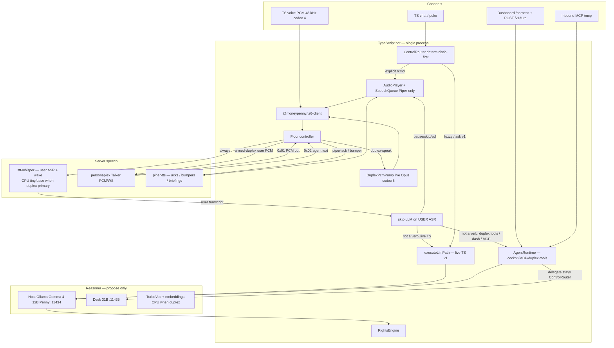
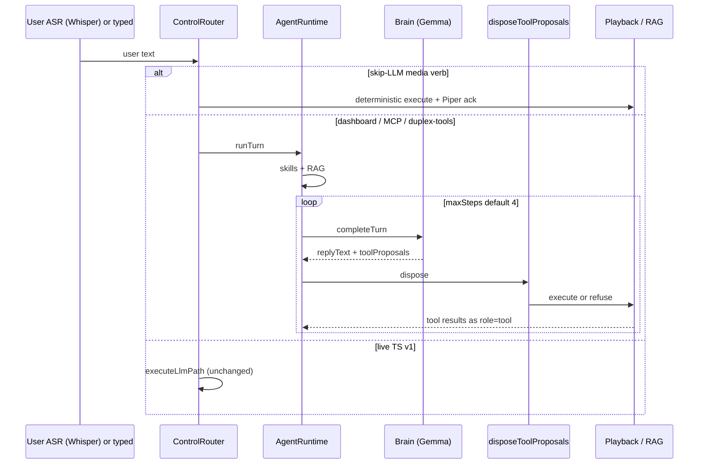
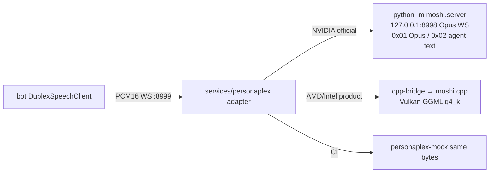

# Moneypenny Full Agent Harness + PersonaPlex Duplex Speech (NVIDIA / AMD / Intel GPU Three-Pack)

| Field | Value |
|---|---|
| **Title** | Moneypenny as first-class agent harness, with PersonaPlex full-duplex speech and three Server GPU packs |
| **Author** | Lane Ambrose / implementer |
| **Date** | 2026-09-06 |
| **Status** | Draft (rev 7 — Q1 Cori clone + Q8 Penny index resolved) |
| **Codename** | Project Moneypenny — Harness + Duplex |
| **Supersedes (product identity)** | “Station that becomes smart when Grok Build is attached.” Grok Build remains an optional MCP *client*; Moneypenny *is* the harness. |
| **Does not supersede** | Spine, brain-proposes/bot-disposes, dual-edition packaging, dual-R9700 pin, cascaded Whisper+Piper default/fallback |
| **Audience** | Senior engineers who know this repo |
| **Related** | [`DESIGN.md`](../DESIGN.md), [`feature-roadmap.md`](feature-roadmap.md), [`brain-boundary.md`](brain-boundary.md), [`mcp-server.md`](mcp-server.md), [`gpu-amd.md`](gpu-amd.md), [`voice.md`](voice.md), [`voice-backends.md`](voice-backends.md), [`editions.md`](editions.md) |

**Base branch:** `origin/dev` already includes `feat/dual-r9700-voice-loop` (`ab7e47e` / #26). Idle-unload (`LlmClient.unload` / `warm`) is still **not** on `dev` — D2/K15 must land it, not assume it. This host has **no NVIDIA GPU** (one R9700 dGPU + Raphael iGPU). Skip PR-N1. Product Talker is moshi.cpp Vulkan, RTF-gated (`scripts/duplex-rtf.sh`). PR-D1 mock + detector + harness multi-step landed on this tree.

---

## Overview

Moneypenny today is a TeamSpeak 6 station with a capable TypeScript spine (queue, radio fail-open, rank gating, Whisper+Piper voice, Gemma 4 12B tools/RAG) and two *optional* agent surfaces: the admin Harness panel (`runHarnessTurn` / `POST /v1/turn` / `/harness`) and an inbound MCP server for Grok Build (`docs/mcp-server.md` §3.2 currently assigns “multi-step agent planning, skills, session memory” to Grok; §18 still calls Grok the preferred operator harness). The 2026-07-09 decision was **Harness first (B)** — grow the harness, keep shipping the station, do not rewrite the spine. That decision stands. What changes is *who owns the agent loop*.

The operator now wants Moneypenny **itself** to be the full harness: the runtime that runs skills, durable turns, tool policy, delegates, multi-step work, and (phased) outbound MCP. Grok Build remains an optional inbound MCP client, not the planner.

On the voice path, the current loop is **cascaded** (listen → transcribe → think → speak) with barge-in on the TTS side only (`SpeechQueue` + `voice.ttsBargeIn`). **PersonaPlex** (`nvidia/personaplex-7b-v1`, Moshi architecture) is the Server **Talker**: full-duplex ear+mouth (interruptions, overlaps, backchannels, 80 ms frames). It is **not** user ASR, **not** an agent, and **not** allowed to call `play_music`. Moshi `0x02` text is the **assistant inner monologue** (captions / “she is speaking”). **User** words come from a real ASR path (Whisper), which is the only input to skip-LLM and Gemma. That Talker–Reasoner split is a locked Key Decision (K13), not a slogan.

PersonaPlex is **Server edition only**. SBC (RK3588) stays on cascaded Whisper RKNN + Piper. Three first-class GPU packs — **NVIDIA, AMD, Intel** — are install-time compose overlays detected by extending `scripts/detect-gpu.sh`. AMD is the current production Server GPU (`docs/gpu-amd.md`, dual R9700: GPU0 desk / GPU1 Penny). NVIDIA is the only *official* PersonaPlex path. Intel is a real product *pack* (overlay, pins, VRAM, fallback); its duplex *engine* is the same moshi.cpp Vulkan family as AMD, measurement-gated per SKU.

**v1 honesty:** AgentRuntime lands first on the cockpit + MCP + duplex *user-ASR* tool path. Live TS chat and cascaded voice stay on `executeLlmPath` until a dedicated unification PR (H5). “Four channels, one loop” is the north star, not the v1 merge.

---

## Background & Motivation

### Current product (verified against code)

| Layer | Owner | Path / contract |
|---|---|---|
| TS6, Opus, queue, radio fail-open, rights | Bot always | `@moneypenny/ts6-client`, `bot/src/audio/opus-voice.ts` (48 kHz mono Opus **codec 4** inbound → PCM). Outbound `sendVoiceData` hardcodes **codec 5** (`client.ts` `this.client.sendVoice(opusFrame, 5)`). |
| Cascaded voice | Bot + HTTP sidecars | `VoiceSession` → `HttpSttClient` `POST /asr` + `POST /asr/stream` → `routeVoice` → `HttpTtsClient` `POST /v1/audio/speech`. TTS plays via temp file + single-stream `AudioPlayer` (ffmpeg → PCM → Opus codec 5). `SpeechQueue` is a serial abortable **job list**, not a PCM pump. |
| Skip-LLM transport | Router | `matchVoiceMediaCommand` in `ControlRouter.routeVoice` — matches **user** phrasing. play/pause/skip/volume/stop/next never touch the 12B. |
| Live LLM path | Router | TS chat + cascaded voice → `executeLlmPath` (`bot/src/control/llm-path.ts`) → `LlmModule.ask` / `chatForIntent` with `onSentence`, clarify-once, `VOICE_RADIO_RULES`, `fromVoice`. **Never** `runHarnessTurn`. |
| Harness cockpit | Admin | `runHarnessTurn` (`maxTools: 8`), `InMemoryHarnessStore` (ring, max 50), `POST /api/bot/harness/ask`, `POST /v1/turn`, MCP `harness_turn`. Tool policy: `HARNESS_SAFE_TOOLS` (blocks stop/vol/move unless `allowDangerous`). |
| Watchword | Voice pipeline | Default `moneypenny`, `requireWatchword: true`, `textWakeFallback: true` — **Whisper text match**. Whisper has no KWS (sherpa KWS removed V2). Silero is VAD only (`vadBackend: "silero"`). `SpeakerArmTracker` extends an already-open window. |
| Server STT sidecar | `stt-whisper-cpp` | `whisper-cli` **per utterance** (`services/stt-whisper-cpp/server.py`). `STT_EAGER_LOAD` verifies binary + path; it does **not** keep weights in VRAM. `_TX_LOCK` serializes CLI. No `/unload`. |
| Conversation ids | Bot | Chat: `dm:<uid>` / `channel` (`conversationKey` in `bot/src/bot/rights/subject.ts`). Voice: `voice:${uid}` (`session.ts`). |
| MCP **server** | Shipped | `/mcp` streamable HTTP, bearer `MCP_TOKEN`, `MCP_TOOL_NAMES_BASE` (no `run_command`) |
| MCP **client** | Not built | DESIGN.md §R2 |
| GPU pin | Server AMD | `PENNY_GPU_INDEX`, `PENNY_RENDER_NODE`; Whisper binds **one** render node. MoneyPenny never loads on GPU 0. |
| Idle VRAM | Uncommitted | `llmIdleUnloadSeconds` default 900; `LlmClient.unload()` via Ollama `keep_alive: 0` |
| Host Ollama Penny | systemd | `host-setup/ollama-penny.service`: `OLLAMA_MAX_LOADED_MODELS=2` (12B + embeddings). Compose overlay uses `1`. **Host unit wins** on production. |
| Context | LLM | Voice `LLM_VOICE_NUM_CTX=8192`; typed `!ask` `LLM_ASK_NUM_CTX=32768`. |

Pain:

1. **Cascaded voice is turn-taking, not conversation.** VAD end-point → Whisper final → 12B → Piper. No backchannels. Under-music reliability is a whole track (H4/V1).
2. **The harness is a cockpit, not a runtime.** One-shot `completeTurn` + dispose; no durable log, no skills, no multi-step tool-result loop. Grok currently owns the “agent” story (`docs/mcp-server.md` §3.2 / §18).
3. **Server GPU docs are AMD-first and NVIDIA-untested** (`docs/editions.md`). PersonaPlex forces a three-vendor pack story. `detect-edition.sh` labels a dual-R9700 host `x86_64 CPU-only` unless `nvidia-smi` exists.
4. **VRAM coexistence is load-bearing.** `scripts/check-analyst-vram.sh` forbids 12B+31B+Whisper resident on 32 GB — and it currently reads **GPU0**’s VRAM line, not Penny.

### Why PersonaPlex (and why not as a second brain or as ASR)

Official: [NVIDIA/personaplex](https://github.com/NVIDIA/personaplex), weights `nvidia/personaplex-7b-v1` (gated, NVIDIA Open Model License + CC-BY-4.0 additional). Moshi + Mimi: 24 kHz, 16 codebooks @ **12.5 Hz** (80 ms/frame). Role via **text prompt**; voice via **18 presets** (NATF0–3, NATM0–3, VARF0–4, VARM0–4) or a short sample.

**Outputs are agent audio + agent text.** User input is audio only. Hugging Face card: “Output Type(s): Text (agent text), Audio (agent speech).” Soniqo: text “mirrors the spoken response” for captions. Moshi streams: user *audio* tokens, system audio, system text — user words are never decoded to text server-side. Community SMART_ROUTING notes the failure mode: the server only has the agent’s text stream and cannot extract the user’s question.

Therefore `0x02` is **never** `routeVoice` / `runTurn` / `matchVoiceMediaCommand` input. Skip-LLM matches *user* phrasing (`bot/src/voice/media-router.ts`). Feeding her inner monologue would make “skip” vanish and Gemma answer herself.

Locked: **PersonaPlex talks; Whisper hears the user; Gemma proposes; bot disposes.**

---

## Goals & Non-Goals

### Goals

1. **Moneypenny is the operator-facing agent runtime (phased).** v1: multi-step dispose, always-injected short skills, durable SQLite turns, inbound MCP unchanged, outbound MCP **thin and later**. North star: voice, chat, dashboard, MCP share one loop (PR-H5).
2. **PersonaPlex is the Server Talker** (duplex ear+mouth). User ASR remains Whisper. Cascaded Whisper+Piper remains default/fallback and the **only** SBC path.
3. **Three real GPU product packs** (NVIDIA / AMD / Intel): compose overlay, device pins, VRAM budget, quant/offload, gated cascaded fallback. Engines may share a C++ bridge; packs stay distinct.
4. **Spine stays.** TypeScript bot owns TS6, Opus, queue, radio fail-open, rights. No OpenClaw. No Python rewrite of the bot.
5. **Brain proposes, bot disposes.** Keep `POST /v1/turn`, `runHarnessTurn`, `disposeToolProposals`. PersonaPlex does not execute tools.
6. **Dual-R9700 pin is load-bearing.** MoneyPenny never loads weights on GPU 0. Duplex and any GPU STT bind Penny’s render node / `PENNY_GPU_INDEX` only.
7. **Compose with in-flight voice work** (streaming sentence TTS, Silero VAD, skip-LLM, idle-unload, pending-play-ack). Duplex does not bypass `routeVoice` for transport verbs.
8. **English-only source** (`AGENTS.md`).
9. **Persona lock.** Short Talker **role** prompt (Miss Moneypenny, dry British wit). Boot voice NATF2; product Talker default is a Piper `en_GB-cori-high` clone (K19). Piper remains Reasoner/bumper/ack mouth (K10). HF token for gated weights.

### Non-Goals

| Non-goal | Why |
|---|---|
| PersonaPlex on SBC / RK3588 | Too small; NPU is for Whisper base |
| PersonaPlex as the tool-caller **or as user ASR** | Not an agent; Moshi `0x02` is her monologue |
| Treating Silero as a watchword detector | Energy VAD only |
| Unifying live TS `executeLlmPath` into AgentRuntime in v1 | Needs PR-H5; claiming it without that PR is false |
| OpenClaw host / dual-bot | Explicitly dumped |
| Python/Rust rewrite of the spine | Locked 2026-07-09 |
| Tensor-split across two cards | `docs/gpu-amd.md`; two Ollama daemons |
| Mixer / talk-over-music v1 | Single-stream player (`DESIGN.md` §10A, `docs/radio.md`). Duplex uses a **live Opus send** path, not a mixer and not SpeechQueue file jobs. |
| Replacing Piper for radio bumpers / skip-LLM acks | Fail-open, cacheable, already instant |
| Bot shelling out to `docker compose` / docker.sock | No control plane; High security hole |
| macOS / Apple Silicon GPU pack | Out of scope |
| Official NVIDIA PyTorch on AMD/Intel | CUDA graphs / `torch.compile` |
| Claiming ONNX “mixed 6.6 GB” as real-time | RTF **3.5×** on RTX 5090 (soniqo) |
| Shipping a second GPU detector | Extend `scripts/detect-gpu.sh` |
| Grok Build as required runtime | Optional MCP client |
| LangGraph / in-process multi-agent framework | `docs/brain-boundary.md` |
| P3 playbook *capture* in v1 | Skills are static markdown; P3 stays plan-only |
| Recording duplex PCM | Only coalesced **user** ASR text hits SQLite |

---

## Key Decisions

| # | Decision | Rationale |
|---|---|---|
| K1 | **Harness-in-bot, not Grok-as-harness.** Expand `bot/src/harness/` into `AgentRuntime`. Grok Build stays an optional inbound MCP client. Update `docs/mcp-server.md` §3.2 ownership and the §18 north star in PR-H4. | Operator intent; avoids dual orchestration. Dual-loop anti-pattern is §3.2 / §18, **not** §7.2 (that is the Phase 2 tool catalog). |
| K2 | **v1 loop coverage is honest.** AgentRuntime serves dashboard, inbound MCP `harness_turn`, and duplex **user-ASR** tool turns. Live TS chat + cascaded voice stay on `executeLlmPath` until **PR-H5**. Deterministic `ControlRouter` still short-circuits skip/pause/play on every channel. | Today those paths never call `runHarnessTurn`. Shipping H1–H4 without H5 must not claim four-channel unification. |
| K3 | **PersonaPlex is Talker I/O, not a brain and not ASR.** PCM in/out. `0x02` = agent inner monologue → captions, speaking-gate, barge-in hints. **Never** `matchVoiceMediaCommand` / `routeVoice` / `AgentRuntime`. | Moshi architecture; skip-LLM is user-phrasing; Gemma must not answer herself. |
| K4 | **Voice mode enum, not a second pipeline.** `voice.mode: "cascaded" \| "duplex"`. **Crash (`ok=false`):** `fallback-cascaded`; auto-return to `idle` when the adapter is reachable again (`ok=true`); `warm()` on next watchword. **RTF hold (`loaded=true` and `realtime=false` for `FALLBACK_HOLD_MS`):** `fallback-cascaded` **sticky** until the operator sets `voice.mode=duplex`; unload Talker so GPU Whisper can run; **do not** treat post-unload `ok=true, loaded=false` as recovery and **do not** `warm()` automatically. Empty-channel unload stays `idle` (not fallback). SBC forces cascaded. | Post-RTF `ok=true` is the healthy unloaded tuple — using it as recovery reloads the slow Talker and oscillates. |
| K5 | **Transport verbs stay skip-LLM on user ASR.** Spoken “skip” / “pause” / “vol” match Whisper (or wake/command ASR) transcripts. Instant acks stay Piper (`TtsAckCache`). PersonaPlex must not be the skip path. | In-flight skip-LLM + pending-play-ack; 7B not between user and skip. |
| K6 | **Three GPU packs as compose overlays + `detect-gpu.sh` keys.** NVIDIA = official `python -m moshi.server` CUDA. AMD/Intel product Talker = **moshi.cpp Vulkan** via a shared **cpp-bridge** (not a mic/SDL CLI in compose). OpenVINO/ORT = experimental flags. | Official PersonaPlex is NVIDIA-only. moshi.cpp Vulkan STS q4_k fps on 6700 XT / Arc B850 are **Moshika proxies**, not PersonaPlex-on-R9700 measurements. |
| K7 | **Penny GPU coexistence (ordered).** (1) Talker q4_k/int8 + 12B Q4 on 32 GB *after measurement*. (2) **Keep `stt-whisper` container always up** with **two** per-call profiles (whisper-cli `-m` is per utterance): **wake** = CPU tiny/base; **cascaded** = Server ladder (`large-v3-turbo` + Vulkan on AMD, CUDA on NVIDIA). Duplex-primary uses **wake** only while Talker VRAM is held. Do not “unload Whisper VRAM” (there is none resident) and do not docker.sock. (3) Idle-unload 12B **and** Talker when `humans=0`. (4) Official BF16 Talker only if 12B is not resident. (5) Never 12B+31B+Talker on one card. (6) Never GPU 0. (7) Never tensor-split. (8) Embeddings **CPU** when duplex is on. (9) **While Talker is resident, penny chat `numCtx=8192`** even for typed `!ask` (`LLM_VOICE_NUM_CTX`). 32k `LLM_ASK_NUM_CTX` only when Talker is not on GPU (cascaded, or after idle-unload). | `whisper-cli` is per-utterance so two models in one container are implementable; 32k KV + Talker is the mixed chat+voice OOM. |
| K8 | **Bot-owned PCM bridge; Moshi wire behind an adapter.** Bot speaks `ws://personaplex:8999/v1/pcm` (PCM16LE). Official Moshi Opus/WS stays on **localhost:8998 inside the NVIDIA container**, never on the bot network. | TS path is PCM. Vue must not talk to moshi.server. |
| K9 | **Watchword defaults ON; idle detector is Whisper CPU, not Silero and not PersonaPlex.** Same one-breath UX as today: on idle Whisper **final**, call existing `extractWatchwordCommand(final, watchword, { textWakeFallback: true })` (`bot/src/voice/watchword.ts`, includes `watchwordAliases`). If `matched` → enter `armed-duplex`. If `command` is non-empty, run skip-LLM then AgentRuntime on **that remainder in the same turn** (same as `processVoiceTurn` / `docs/voice.md` “Moneypenny, pause”). Watchword-only still arms and waits. Armed: PCM to Talker **and** user ASR. `duplex-open` is admin + `@analyst`/admin rank. `listenWindowMs` default **30000** when `mode=duplex`. | Idle “tools = no” would regress one-breath skip. Aliases already live in `watchword.ts`; D2 must call that function, not reimplement “ASR contains watchword.” |
| K10 | **Piper is the v1 mouth for every Reasoner `replyText` under duplex (short or long), plus bumpers, skip-LLM acks, and pending “On it.”** Talker is small-talk / backchannel only until the next idle (or until the Reasoner floor slice ends). As soon as user ASR final is **not** a skip-LLM media verb, `mute_out` Talker and Piper the Gemma/AgentRuntime reply — including one-sentence doctrine. No prompt-nudge into Talker in v1. | ≤3-sentence doctrine answers must not stay text-only while Talker ad-libs. TurboVec cannot ride in the Talker prompt. |
| K11 | **HF gated weights + NVIDIA Open Model License are operator steps.** `HF_TOKEN` in `.env`. Installer accept-license is **blocking for `--with-duplex`**, cascaded install continues without it. | Cannot bake weights into public images. |
| K12 | **No mixer in v1.** Music still ducks/stops per existing player. Duplex audio is **not** a SpeechQueue file job. | File/ffmpeg jobs cannot do 80 ms frames. |
| K13 | **Talker–Reasoner split (locked v1).** Talker = PersonaPlex (duplex speech). Reasoner = Gemma via existing brain (`completeTurn` / `executeLlmPath`). **User ASR = Whisper** (CPU tiny/base while duplex primary; existing Server Vulkan/CUDA ladder when cascaded). Tools, skip-LLM, RAG, watchword, durable `user_text` all see **user ASR**, never `0x02`. | Only implementable contract that preserves skip-LLM and doctrine Q&A. |
| K14 | **Duplex output sink is live Opus send (codec 5) with exclusive ownership.** `AudioPlayer` (`bindPlayerEvents` `player.on("frame") → sendVoiceData`) is today’s sole producer. `DuplexPcmPump` must **not** share that loop. Floor `duplex-speak` **pauses the player send loop** (reuse `savedMusic` / duck restore, same exclusive semantics as TTS `player.play(file)`). Pump upmixes Talker **mono → stereo**, encodes with a **dedicated** 48 kHz stereo 20 ms Opus instance (`createOpusEncoder()` defaults: `CHANNELS=2`, `PCM_FRAME_BYTES=3840`) — never steal `player.encoder`. Floor `music\|silence\|piper-ack\|bumper` → pump does not send; player owns frames. **Never two `sendVoiceData` callers in the same 20 ms slot.** Do not use codec 4 outbound. SpeechQueue stays Piper-only. | Interleaving two Opus encoders on one TS client is garbage audio, not a mixer. |
| K15 | **v1 Q2/Q3/Q4 defaults are decisions.** (Q2) **All** Reasoner `replyText` under duplex uses Piper (K10) — not only >3 sentences. (Q3) Empty channel: unload **both** 12B **weights** (`LlmClient.unload`) **and Talker weights** (`DuplexClient.unload`). Adapter stays **`ok=true`, `loaded=false`**. Bot remains `idle` (not `fallback-cascaded`). First `extractWatchwordCommand` → `warm()` (Talker audio blocks on warm; skip-LLM still immediate). Warm 12B on human join. (Q4) `duplex-open` is Settings + admin/`@analyst` rank; default remains `duplex-gated`. | `vram_mb` is **Talker process only** (not `nvidia-smi`/`rocm-smi` card used — 12B must not keep `vram_mb` at 8 GB). NVIDIA `unload` SIGTERM `moshi.server` and **does not restart it until `warm`**. |
| K16 | **Single floor controller in `VoiceSession`.** Modes `{ music, piper-ack, bumper, duplex-speak, silence }`. Rising edge `speaking=true` in an armed session **steals** the player (pause send loop, park `savedMusic`). Falling edge / floor=`music` restores. Duplex PCM may enter `sendVoiceData` only in `duplex-speak` via the dedicated pump (K14). Piper acks, pending-play-ack, Reasoner Piper (K10), and radio bumpers take the floor and `mute_out` Talker **output** (user PCM may still flow in for Moshi interruption). Skip-LLM `stop`/`pause` takes the floor. Karaoke: duck on **user VAD** only. | In-flight pending-ack, skip-TTS-when-song-is-reply, bumper ownership, barge-in-cuts-TTS-not-music. |
| K17 | **Skip-LLM under duplex is Whisper-final, not 80 ms.** Server `stt-whisper-cpp` `feed_stream` returns empty `partial`; final after `SILENCE_TAIL_S=0.8` + CPU `whisper-cli`. Native Moshi barge-in can cut **her** audio in ~200 ms; **song skip / pause waits on ASR final**, same as cascaded Server today. No tiny command classifier on partials in v1. | Operators must not think duplex skip is 200 ms. `tryRouteArmedPartial` cannot fire without partials. |
| K18 | **Installer Penny index (Q8 resolved 2026-09-06).** `gpu_count=1` ⇒ write `PENNY_GPU_INDEX=0` (and the matching render node). `gpu_count>=2` ⇒ **refuse** to write compose until the operator confirms Penny index / render node. Never silent-default 0 on a dual-GPU desk. | Operator confirmed. `${PENNY_GPU_INDEX:?}` stays for dual-GPU; a one-GPU host must still boot. |
| K19 | **Talker voice identity (Q1 resolved 2026-09-06).** NVIDIA ships 18 **unlabeled-by-accent** presets only (NATF/NATM/VARF/VARM). There is **no British-labeled stock voice**. Accent lives in the **audio embedding**, not the text prompt. **Boot:** `NATF2` (official demo / LiveKit / HF “Natural Female” default) so `--with-duplex` works from `voices.tgz` alone. **Product default after first boot / Settings:** zero-shot **Cori clone** — 3–10 s of Piper `en_GB-cori-high` as the Talker voice prompt (paper §3.1 Hybrid System Prompt). Settings lists all 18 presets plus “Cori clone”. Piper remains the mouth for Reasoner replies, acks, and bumpers (K10) so bumpers stay Cori even while Talker small-talk is still NATF2. Text prompt is **role** (Miss Moneypenny, dry British wit), not accent. If clone listen-test fails (paper SSIM ~0.57–0.65; q4_k drift), stay on NATF2 for Talker and Piper for all Reasoner speech. | NVIDIA README Voices; paper arXiv:2602.06053 Appendix A (Fisher US + Chatterbox/TortoiseTTS); banking demo “accent control using voice prompting”. |

---

## Proposed Design

### 1. Target architecture (Talker–Reasoner)



PersonaPlex never sits on the skip-LLM or Gemma input edge.

### 2. AgentRuntime (harness as product) — v1 scope

Today `runHarnessTurn` is one-shot: `completeTurn` → `disposeToolProposals` → ring buffer. Good cockpit; not a runtime.

**v1 loop** (dashboard, MCP `harness_turn`, duplex user-ASR tool turns only):

```
TurnRequest (user ASR or typed text — never Moshi 0x02)
  → inject skills (short markdown, cap) + RAG pack
  → completeTurn (intent)
  → disposeToolProposals (channel-appropriate policy ∩ rights)
  → if tools ran and steps < maxSteps: follow-up completeTurn with role=tool messages
  → persist SQLite harness_turns
  → emit to originating sink
```

Live TS chat/cascaded voice **do not** enter this loop until PR-H5. They keep `executeLlmPath` (streaming `onSentence`, clarify-once, `VOICE_RADIO_RULES`, pending-play-ack).



#### 2.1 Module layout

```
bot/src/harness/
  run-turn.ts          # keep; wrapper over runtime.ts
  tool-policy.ts       # cockpit/MCP only until H5; NEVER applied to skip-LLM
  store.ts             # ring buffer for /harness live view
  types.ts             # Skill, DurableTurn; TurnChannel additive
  runtime.ts           # NEW AgentRuntime.runTurn
  skills.ts            # NEW load bot/data/skills/*.md
  durable.ts           # NEW SQLite harness_turns
  mcp-client.ts        # NEW — PR-H3, after H2, default disabled
```

Do **not** extract a Python brain until feature-roadmap §5 pain criteria still hold after this loop exists.

#### 2.2 Skills (v1: static, always injected, capped)

v1 does **not** implement P3 playbook capture (`playbooksEnabled` stays off). Skills are static markdown the operator drops in `bot/data/skills/`. Examples: `docs/examples/skills/*.example.md`.

```markdown
---
name: hangar-dj
tools: [play_music, select_tracks, queue, skip, now_playing]
maxSteps: 3
---
Prefer LocalProvider. If the user names a tag/BPM, use select_tracks.
Never call stop or set_volume unless they said so.
```

- **No `when:` router in v1.** All enabled skills are concatenated into the Gemma system context for `mode=intent|ask` on AgentRuntime paths only.
- Caps: max **4** files, **2 KiB** each, **6 KiB** total (P2 budget spirit). Overflow: log and drop extras, do not silently truncate mid-file.
- Tool allowlist **intersects** the channel policy: cockpit uses `HARNESS_SAFE_TOOLS`; a skill cannot grant `move_all_clients`. Live skip-LLM verbs are not skill-gated.
- Inject in `createInProcessBrain` via `TurnRequest` optional `skill` / packed skills string — **PR-H2 must touch** `bot/src/brain/in-process.ts`, `types.ts` (`TurnRequest.skill?`), not only `skills.ts` + Vue.
- **Not** injected into PersonaPlex (Talker gets the short K10 persona prompt only).

#### 2.3 Durable turns

`InMemoryHarnessStore` stays the dashboard ring (50). SQLite `harness_turns`:

| Column | Notes |
|---|---|
| `id` | `turnId` |
| `at` | epoch ms |
| `channel` | `dashboard` \| `teamspeak` \| `voice` \| `mcp` |
| `conversation_id` | `dm:<uid>` \| `channel` \| `voice:${uid}` |
| `user_uid` | subject |
| `mode` | `ask` \| `intent` \| `delegate` |
| `user_text` | **user ASR or typed** — never agent `0x02` |
| `reply_text` | Gemma / tool summary |
| `tools_json` | disposed records |
| `sources_json` | |
| `error` | soft |
| `steps` | multi-step count |

Retention: 30 days. Duplex **PCM is not recorded**. MCP `harness_turns` v1 still lists the ring; adding `durable=true` is a follow-up arg on the **same** tool (not v1-blocking).

Do **not** add `TurnChannel: "duplex"`. User turns under Talker mode are still `channel: "voice"` (same subject resolution, `voice:${uid}`). Talker is an output mode, not a brain channel. Wake vs talk does not flip `TurnChannel` mid-utterance.

#### 2.4 Multi-step dispose loop

- `runHarnessTurn` today passes `maxTools: 8`. **H1 standardizes on 8** (InProcessBrain cap remains 16). Do not leave 4 vs 8 drift.
- `options.maxSteps` default **4**.
- After dispose, if any tool `ok` and `mode=intent` and steps remain: second `completeTurn` with proper `ChatMessage.role: "tool"` (already on `LlmClient`) — **not** a fake user utterance `[play_music → queued X]`.
- Stop on: no proposals, all blocked, `maxSteps`, brain `error`.
- Music fail-open: this loop is never on the player hot path.
- **Golden test (H1):** intent “play something chill” → `play_music` disposed → follow-up ask sees the queue result via tool message.
- Live `executeIntent` still executes multiple tool calls **once** without a second completeTurn. Two loops will diverge until H5; document that, do not silently change live TS in H1.

**Delegates:** `!analyst` / `delegate_to_agent` stay on `ControlRouter` + `bot/src/llm/delegate.ts`. `InProcessBrain` keeps stubbing `mode=delegate` (“use ControlRouter !analyst”). AgentRuntime does **not** reimplement analyst in v1.

#### 2.5 Outbound MCP client (PR-H3, after H2)

Opt-in, allowlist-only, **not** in the first harness wave.

- Transport: **streamable HTTP** + bearer, same family as inbound (`@modelcontextprotocol/sdk` client).
- Static tool map in config (no runtime discovery of arbitrary tools). Each allowlisted remote tool becomes a **named** LLM tool (`ha_light_turn_on`) with a frozen JSON schema in repo.
- `url` must pass `bot/src/music/url-guard.ts` (LAN/private allow, block metadata/cloud SSRF). Fail closed on guard miss.
- Timeouts: 10 s connect, 30 s call. Fail-open: `ok:false`, music continues.
- Never generic `mcp_call` / `exec`.
- Inbound `/mcp` unchanged.

#### 2.6 Channel adapters (v1 vs north star)

| Channel | v1 owner | Input | Output | Tool policy |
|---|---|---|---|---|
| `teamspeak` | `executeLlmPath` | typed chat | `sendTextMessage` (+ Piper if `!ask -s`) | rights + CommandRegistry; **not** `HARNESS_SAFE_TOOLS` |
| `voice` cascaded | `executeLlmPath` + `VoicePipeline` | Whisper user ASR | Piper / `onSentence` | same as live TS |
| `voice` + Talker | skip-LLM + AgentRuntime; Talker small-talk until Reasoner reply | Whisper user ASR | Talker PCM (backchannel/small-talk) + **Piper for every non-empty Reasoner `replyText`** (K10) and acks | skip-LLM unrestricted by harness safe-list; AgentRuntime tools use safe-list ∩ rights |
| `dashboard` | AgentRuntime | admin text | `HarnessTurn` JSON | `HARNESS_SAFE_TOOLS` unless `allowDangerous` |
| `mcp` | AgentRuntime via `harness_turn` | MCP args | envelope | token profile + safe-list |

### 3. PersonaPlex Talker + user ASR

#### 3.1 Voice mode and config

```ts
export type VoiceMode = "cascaded" | "duplex";
export type DuplexWatch = "gated" | "open";
export type DuplexFallback = "cascaded" | "none";

export interface VoiceConfig {
  // existing fields unchanged
  enabled: boolean;
  sttUrl: string;
  ttsUrl: string;
  ttsVoice: string;
  ttsBargeIn: boolean;
  requireWatchword: boolean;
  watchword: string;
  textWakeFallback: boolean; // remains true — wake is Whisper text
  listenWindowMs: number;    // duplex default 30000
  vadBackend?: "energy" | "silero";
  mode: VoiceMode;                 // default "cascaded"
  duplexUrl: string;               // http://personaplex:8999
  duplexWatch: DuplexWatch;        // default "gated"
  duplexVoice: string;             // boot NATF2; product default "cori-clone" after first Settings/boot helper
  duplexFallback: DuplexFallback;  // default "cascaded"
}
```

SBC installer **forces** `mode=cascaded` and refuses `--with-duplex`.

#### 3.2 Wake-state machine (idle detector named)

```mermaid
stateDiagram-v2
  [*] --> Idle
  Idle --> ArmedDuplex: extractWatchwordCommand matched
  Idle --> FallbackCascaded: health.ok=false (adapter crash/down)
  Idle --> Idle: intentional unload loaded=false (empty channel)
  ArmedDuplex --> Idle: listenWindowMs expiry AND no user VAD
  ArmedDuplex --> FallbackRtf: loaded=true AND realtime=false for FALLBACK_HOLD_MS
  FallbackCascaded --> Idle: adapter ok=true again (crash recovered)
  FallbackRtf --> Idle: operator sets voice.mode=duplex
  note right of FallbackRtf: unload Talker; ok=true loaded=false\nis NOT recovery; do not warm()
  note right of Idle: PCM → Whisper wake profile CPU tiny\nOn final: extractWatchwordCommand\nIf loaded=false: warm() then arm\nIf command remainder: skip-LLM same turn
  note right of ArmedDuplex: PCM → Talker + Whisper wake profile\nskip-LLM + Gemma on user ASR\nTalker out only if floor=duplex-speak
```

**Idle one-breath (mandatory, same as `docs/voice.md` / `processVoiceTurn`):** on Whisper **final** in `idle`, call `extractWatchwordCommand(final, this.watchword, { textWakeFallback: true })` (`bot/src/voice/watchword.ts`). That function already applies `watchwordAliases` (`money penny`, etc.).

| `WatchwordMatch` | Next |
|---|---|
| `matched && command` non-empty (“Moneypenny skip”) | enter `armed-duplex`; run skip-LLM then AgentRuntime on **`command` in this same turn**; do not wait for a second utterance |
| `matched && command` empty (“Moneypenny”) | enter `armed-duplex`; wait up to `listenWindowMs` |
| not `matched` | stay `idle`; ignore |

| State | User PCM → Whisper | User PCM → Talker | Audible Talker | Tools |
|---|---|---|---|---|
| `idle` (`duplex-gated`) | **wake profile** (CPU tiny/base) | **no** | no | **yes, if this final’s remainder is a command** |
| `armed-duplex` | wake profile (CPU tiny/base) | yes | if floor=`duplex-speak` and Reasoner is not speaking | skip-LLM + AgentRuntime on **user** sentences |
| `duplex-open` (rank-gated) | wake profile | yes | if floor=`duplex-speak` | skip-LLM always; Gemma on non-backchannel **user** sentences |
| `fallback-cascaded` | **cascaded profile** (turbo after Talker `loaded=false`; CPU tiny for at most the in-flight utterance) | no | no | existing `VoicePipeline`. **Crash path:** auto-return to `idle` when `ok=true`. |
| `fallback-rtf` | same STT as `fallback-cascaded` | no | no | same pipeline. **Sticky** until operator `voice.mode=duplex`. No auto-`warm()`. |

**Silero is not watchword.** It remains VAD for duck, utterance bounds, and karaoke duck-on-user-speech.

**Pre-arm duck (under-music):** keep `ensureMusicDuckedOnWake` / energy duck so **CPU Whisper can hear the name**. If unducked music is the only signal, wake fails (H4/V1 still applies). Do not feed unducked playlist into Mimi in `idle` (we are not sending PCM to Talker then). In `armed-duplex` / `duplex-open`, still duck on user VAD so Mimi hears the speaker, not the DJ.

`duplex-open` without a dedicated channel is a High privacy setting; default remains gated.

#### 3.3 User ASR: two Whisper profiles in one always-up container

Keep **one** `stt-whisper` container always up. Bot does **not** `docker compose start/stop`. `whisper-cli` is **per utterance** (`transcribe_audio` + `_TX_LOCK`), so model/device can change **per request** without a process restart. Extend the existing HTTP contract with one header (additive; default preserves today’s env):

```
POST /asr/stream  (and POST /asr)
  X-Stt-Profile: wake | cascaded
```

| Profile | Env (installer) | Model | Device | When |
|---|---|---|---|---|
| `wake` | `STT_MODEL_WAKE=tiny` (or `base`), `STT_DEVICE_WAKE=cpu` | ggml-tiny/base | **CPU** | Duplex-primary: idle watchword **and** armed command ASR. Never Vulkan/CUDA while Talker holds Penny VRAM. |
| `cascaded` | `STT_MODEL_CASCADED=large-v3-turbo`, `STT_DEVICE_CASCADED=vulkan` (AMD) / `cuda` (NVIDIA) / `cpu` (Intel) | Server ladder | GPU after Talker released | `voice.mode=cascaded` **or** `fallback-cascaded` **after** Talker VRAM is gone |

`HttpSttClient.feedStream` grows an optional `profile` argument; duplex idle/armed send `wake`. Existing callers omit the header → sidecar uses process env (`STT_MODEL` / `STT_DEVICE`) so cascaded-only hosts stay byte-compatible.

**Health contract (`GET /health` + `DuplexHealth`). `vram_mb` is Talker-process only:**

| Situation | `ok` | `loaded` | `realtime` | `vram_mb` |
|---|---|---|---|---|
| Weights resident, RTF OK | `true` | `true` | `true` | Talker CUDA/ggml context (e.g. ~6000). **Must not** include host Ollama 12B / card `memory.used`. |
| Weights resident, RTF bad | `true` | `true` | `false` | same (Talker only) |
| **Intentional unload** (empty channel or post-fallback free) | **`true`** | **`false`** | **`false`** | Talker process only, **≤256**. Adapter still serving HTTP. NVIDIA: `moshi.server` **absent** after SIGTERM. |
| Adapter crash / TCP fail / process dead | **`false`** | — | — | n/a |

Never scrape `nvidia-smi` / `rocm-smi` GPU-total into `vram_mb`. Report the engine’s own allocator (CUDA context for this PID, ggml Vulkan device memory for the cpp-bridge). `plan-vram.sh` still reads **card** used for operators; that is a different number.

**Fallback vs empty-channel (do not conflate):**

| Event | Bot state | STT | Exit / next watchword |
|---|---|---|---|
| `ok=false` (adapter down) | `fallback-cascaded` **immediately** | `cascaded` (best-effort `unload` if `loaded` was true, with timeout) | **Auto-return to `idle`** when adapter is reachable again (`ok=true`). Then first `extractWatchwordCommand` → `warm()` (crash can self-heal). |
| `loaded=true` and `realtime=false` for `FALLBACK_HOLD_MS` | **`fallback-rtf`** (same STT/pipeline as `fallback-cascaded`; distinct **recovery**) | `mute_out` → `unload` → wait `loaded=false` **and** `vram_mb<=256` → `X-Stt-Profile: cascaded` | **Sticky.** Stay cascaded until the **operator** sets `voice.mode=duplex`. Post-unload `ok=true && loaded=false` is **not** recovery. **Do not `warm()`.** |
| Empty channel (K15) | stay **`idle`**, `mode=duplex` | keep **`wake`** (CPU tiny) | `extractWatchwordCommand` → **`warm()`** then `armed-duplex` |

D1 tests: after simulated RTF hold + unload, state remains `fallback-rtf` **while** `ok=true && loaded=false` (must not transition to `idle` or call `warm()`). Crash-fallback test: `ok=false` then `ok=true` returns to `idle` without an operator mode flip.

RTF hold **applies only when `loaded=true`**. Unloaded `realtime=false` is expected and **must not** start `FALLBACK_HOLD_MS`.

**Unload implementation:**

1. Floor `mute_out`.
2. `DuplexClient.unload()` → `0x03 { "op": "unload" }`. **Must drop Talker weights.** NVIDIA: adapter **SIGTERM `moshi.server` and does not restart it** until `warm`. cpp-bridge: **free ggml Vulkan** (destroy context; HTTP stays). Mock: `loaded=false`, `vram_mb=0`. Closing the PCM WebSocket is **not** unload.
3. Poll `/health` until `ok=true && loaded=false && vram_mb <= TALKER_VRAM_IDLE_MB` (**256**), or **`UNLOAD_TIMEOUT_MS` (15000)** — then log, stay on `wake` CPU, **do not hang**, do not assume GPU Whisper is safe.
4. **Forbidden:** treating `ok=true` / “engine idle” / `realtime=false` as weights-released while `loaded=true` or `vram_mb > 256`.
5. While `loaded=true`, refuse `cascaded` GPU Whisper. Never concurrent `whisper-cli` Vulkan on GPU1 with the Talker.

**Warm:** `DuplexClient.warm()` → `0x03 { "op": "warm" }` on first `extractWatchwordCommand` match while `loaded=false` (empty-channel path). NVIDIA: start `moshi.server` again. Warm is blocking for Talker audio; skip-LLM on the wake remainder still runs immediately. Human join warms **12B** only; Talker stays unloaded until watchword (saves VRAM while people sit in channel silently).

If later we want resident whisper.cpp, that is a **separate** `/load` `/unload` PR on the STT sidecar. Not v1. Talker unload/warm **is** v1.

#### 3.4 Sidecar contract (adapter vs engine)

Service: `personaplex`, profile `voice-duplex`. **Bot** talks only to the adapter on **8999**. Engine ports stay inside the container network namespace (NVIDIA moshi.server `127.0.0.1:8998`).

**Framing table** (`/v1/pcm` binary WebSocket). This is the **adapter** protocol, not official Moshi. Do not copy Moshi `0x01=Opus` into the bot.

| Dir | Byte | Payload | Meaning |
|---|---|---|---|
| C→S | `0x01` | PCM16LE mono | User audio. Bot may send 20 ms / 48 kHz frames; sidecar SRC + jitter-buffers to 1920 samples @ 24 kHz (80 ms). Headerless PCM after the kind byte. |
| C→S | `0x03` | UTF-8 JSON | Control: `{ "op": "prompt" \| "voice" \| "reset" \| "mute_out" \| "unload" \| "warm", ... }` |
| C→S | `0x02` | — | **Forbidden** on adapter inbound (reserved so nobody maps Moshi text the wrong way). |
| S→C | `0x01` | PCM16LE mono 24 kHz | **Agent** audio. Sidecar may upsample to 48 kHz if `POST /v1/control` asked; default 24 kHz, bot SRC to 48 kHz before Opus. |
| S→C | `0x02` | UTF-8 | **Agent** inner monologue piece (SentencePiece). Captions / speaking hint **only**. |
| S→C | `0x04` | UTF-8 JSON | `{ "speaking": bool, "rtf": number, "backchannel": bool }` |

```
GET /health → {
  "ok": true,
  "loaded": true,
  "engine": "moshi-cuda" | "moshicpp-vulkan" | "mock",
  "realtime": true,
  "rtf": 0.94,
  "vram_mb": 6120,
  "voice": "NATF2",
  "sample_rate": 24000,
  "frame_hz": 12.5
}
# vram_mb = this Talker process's CUDA/ggml context only. Never card-total.
```

Experimental engines (`onnx-cuda`, `onnx-openvino`, `onnx-migraphx`) may appear in logs when flagged; they are **not** in the product `/health` enum until those PRs land. Mock engine `mock` is required for CI (`personaplex-mock`, compose profile `voice-duplex-dev` next to `voice-dev`).

**RTF constants (one set):**

| Name | Value | Action |
|---|---|---|
| `RTF_REALTIME` | **1.15** | `health.realtime = (ewma_rtf <= 1.15)` when `loaded=true` |
| `FALLBACK_HOLD_MS` | **8000** | Enter **sticky** `fallback-rtf` if **`loaded=true` and `realtime=false`** for this long. Exit **only** via operator `voice.mode=duplex`. |
| `OK_FALSE` | immediate | `ok=false` (adapter down) → `fallback-cascaded` **immediately**. Recovers to `idle` when `ok=true` again. Unloaded `ok=true, loaded=false` is **not** `ok=false`. |
| `TALKER_VRAM_IDLE_MB` | **256** | `unload` complete when `loaded=false` **and** Talker-only `vram_mb <= 256` |
| `UNLOAD_TIMEOUT_MS` | **15000** | `unload()` must not hang; on timeout stay on `wake` CPU, do not start GPU Whisper |
| Dashboard banner | tracks **bot mode**, not a second timer | Banner = current `VoiceSession` mode |

Do not use a third threshold of 1.3.

`POST /v1/control` (same ops as WS `0x03`):

| `op` | Effect |
|---|---|
| `prompt` / `voice` | session persona |
| `reset` | clear KV / conversation; **weights stay** |
| `mute_out` | silence Talker PCM; **weights stay**; user PCM still accepted |
| `unload` | **drop weights**; HTTP stays; `ok=true`, `loaded=false`, Talker-only `vram_mb <= 256`. NVIDIA: SIGTERM `moshi.server`, **do not auto-restart**. |
| `warm` | start/load engine (blocking); `loaded=true`; `vram_mb` = Talker working set |

`mute_out` is how the floor controller silences Talker output without stopping user PCM. It is **not** unload.

#### 3.5 Engine adapters (product vs research)



| Pack | Product Talker engine | Status | Notes |
|---|---|---|---|
| **NVIDIA** | `python -m moshi.server` CUDA BF16 | Official | Pin a **git commit** in `Dockerfile.nvidia`; WebSocket path **`/api/chat`**. `--cpu-offload` / moshi.cpp CUDA q4_k / ORT int8 = consumer off-ramps (N2). |
| **AMD** | moshi.cpp Vulkan q4_k via **cpp-bridge** | Community; **GA gated on R9700 GPU1 `duplex-rtf.sh`** | Not the SDL mic CLI. Dockerfile pins `codes4Fun/ggml` branch `for_moshi`, SentencePiece static, FFmpeg 7+, radv ICD. |
| **Intel** | **Same cpp-bridge image**, anv/xe ICD, discrete Arc render node | Community; **measurement-gated per SKU** | Moshika STS q4_k 16.45 fps on B850 Linux is a **proxy**, not a PersonaPlex-on-B850 table. OpenVINO = PR-I2 experimental. |

moshi.cpp published Vulkan STS q4_k fps (beta2, **Moshika `moshi-sts`**, not PersonaPlex): RX 6700 XT Linux 17.84 fps; Arc B850 Linux 16.45 / Win11 22.03. Need 12.5 fps. Ballpark for 7B-shaped Moshi is fair; **do not** call Intel “the honest duplex path” until PersonaPlex q4_k is timed on that SKU.

**cpp-bridge (PR-D1.5, blocks A1/I1 and non-mock engines):** stdio or in-process moshi.cpp, `/health` with **`loaded` + Talker-only `vram_mb`**, voice switch, reset, `mute_out`, **`unload` (free ggml Vulkan, `loaded=false`)**, **`warm` (reload GGUF)**, single session, **same bytes as mock** (mock `unload` → `ok=true, loaded=false, vram_mb=0`; `warm` → `loaded=true` + fake working set). NVIDIA official image (N1): `unload` **SIGTERM `moshi.server` and leave it dead**; adapter still answers `/health` with `ok=true, loaded=false`. `warm` starts `moshi.server` again. NVIDIA PR #61 framed PCM is prior art, not a dependency.

#### 3.6 Audio I/O vs TeamSpeak

Verified: inbound codec 4 @ 48 kHz; outbound `sendVoice(..., 5)`; TTS = temp file + `AudioPlayer`; `SpeechQueue` = job list.

**v1 output path (K14): live Opus send with exclusive `sendVoiceData` owner.**

Today `bindPlayerEvents` is the **only** producer: `player.on("frame") → tsClient.sendVoiceData`. Player encoder is **stereo** 48 kHz / 20 ms (`createOpusEncoder()` default `CHANNELS=2`, `PCM_FRAME_BYTES=3840` in `bot/src/audio/encoder.ts`). Talker PCM is **mono**. TTS already speaks by `player.play(file)` (exclusive send, `savedMusic`). Duplex-speak needs the same exclusive semantics with a live pump instead of a wav.

1. `handleVoiceData` still decodes codec 4 → 48 kHz PCM; Silero for VAD/duck.
2. **Idle:** 48 kHz chunks → `HttpSttClient.feedStream({ profile: "wake" })`. Not to Talker. On **final**, `extractWatchwordCommand` (K9) — remainder skip-LLM **same turn**.
3. **Armed:** same **wake** ASR stream **and** WS `0x01` to adapter. Sidecar jitter-buffers 20 ms TS frames to 80 ms Mimi frames (**sidecar owns the 80 ms clock**).
4. Adapter returns agent **mono** PCM. Bot SRC to 48 kHz if needed, **upmix mono → stereo** (duplicate L/R) for the pump.
5. **Mux:** `DuplexPcmPump` holds a **dedicated** stereo Opus encoder — **never** `player.encoder`.
   - `floor=duplex-speak` **and** (`0x04.speaking` or PCM peak) → **pause AudioPlayer frame loop** (park `savedMusic` / duck restore, same as TTS), pump encodes 20 ms stereo frames, `sendVoiceData`. Silence frames do **not** steal the player.
   - `floor=music|silence|piper-ack|bumper` → pump **does not send**; player owns `sendVoiceData`.
   - **Never two `sendVoiceData` callers in the same 20 ms slot.** Assert in D2 tests.
6. **Barge-in:** user PCM keeps flowing to Talker (native Moshi interruption of **her** audio, ~200 ms). `SpeechQueue.interrupt()` still cuts **Piper only**. Do not hard-cut Talker output on every VAD blip. Floor changes (skip-LLM stop/pause, bumper, pending-ack, Reasoner Piper) call `mute_out`.
7. **Self-echo:** `clientId === bot` unchanged. Never WS-loop our codec 5 packets into the Talker. Do not switch outbound to codec 4.
8. **Pending-play-ack:** Piper “On it.” takes floor=`piper-ack`; `preparePendingPlayAck` remains. Talker `mute_out` until ack finishes. Then if the reply is `isPlaybackStartReply`, floor=`music` and **do not** speak Talker or Piper over the song.
9. **Reasoner mouth (K10):** when user ASR final is **not** a skip-LLM verb, `mute_out` Talker, floor=`piper-ack` (or a `piper-reasoner` alias of the same exclusive send), Piper **the full Gemma `replyText`** (one sentence or a briefing). Talker stays muted until that Piper job ends, then idle/armed small-talk may resume.
10. **Bumpers:** radio director takes floor=`bumper`, `mute_out` Talker, existing SpeechQueue Piper bumper. Hook: `VoiceSession.setFloor("bumper"|"music")`. Tests next to `pipeline.test.ts` pending-ack ordering **and** “no dual sendVoice in one slot.”

**Latency budget (target ~200 ms speaker-switch, Talker path only):**

| Stage | Budget |
|---|---|
| TS inbound packet + Opus decode | ~20 ms |
| Sidecar jitter + SRC 48→24 | 0–80 ms (one Mimi frame) |
| Moshi / moshi.cpp step | ~80 ms (frame budget) |
| SRC 24→48 + Opus encode codec 5 | ~10 ms |
| NVIDIA official extra: adapter Opus round-trip to moshi.server | ≤20 ms (measure in N1) |
| **Sum (happy)** | **~130–210 ms** |

That budget is **Talker conversational barge-in only** (she stops talking). **Skip / pause / play** wait on Whisper **final**: `SILENCE_TAIL_S=0.8` + CPU `whisper-cli` load — same order as cascaded Server today (K17). Server `feed_stream` `partial` is always `""`; in-flight `tryRouteArmedPartial` cannot fire. Optional later: a tiny command classifier on energy, not v1.

File-based SpeechQueue bursts are **not** the Talker path (Piper acks/bumpers/Reasoner still use SpeechQueue + player exclusive send).

**One speaker.** Armed/priority client only. Watchword can steal the floor. Do not mix N users into Mimi.

#### 3.7 Text paths (who sees what)

| Stream | Goes to skip-LLM | Goes to Gemma | Goes to captions | Stored in `harness_turns.user_text` |
|---|---|---|---|---|
| Whisper user ASR | **yes** | **yes** (if not a verb) | optional | **yes** |
| Moshi `0x02` agent text | **no** | **no** | **yes** | **no** |
| User backchannels in ASR (`mm-hmm`) | no | no | no | no |

PersonaPlex prompt (Talker only):

```
You are Miss Moneypenny, MI6 secretary and this organisation's music and intelligence officer.
Dry British wit; teasing, mock-formal; never crude. British spelling.
You are on a voice radio. Short spoken replies. Direct speech only.
You cannot play music or look up files. If they ask for music, doctrine, or tools,
acknowledge briefly; the desk handles it. Do not mention being a model.
```

Doctrine/RAG stays on Gemma from **user ASR**. Talker small-talk is ungrounded by design (K13) and is **cut off** as soon as a non-verb user final arrives (K10): `mute_out` + Piper the Reasoner answer, short or long. Prompt cannot cite TurboVec; Piper can speak the cited reply.

#### 3.8 Voice identity (Q1 locked)

NVIDIA PersonaPlex ships **18 unlabeled-by-accent** embeddings in `voices.tgz` ([NVIDIA/personaplex README “Voices”](https://github.com/NVIDIA/personaplex)). There is **no British-labeled stock voice**. LiveKit default `voice=NATF2`; Hugging Face spaces map “Natural Female” → `NATF2.pt`; official offline assistant example uses `--voice-prompt NATF2.pt`. NVIDIA publishes **no** accent, age, or timbre notes.

| Category | IDs |
|---|---|
| Natural female | NATF0, NATF1, **NATF2**, NATF3 |
| Natural male | NATM0, NATM1, NATM2, NATM3 |
| Variety female | VARF0, VARF1, VARF2, VARF3, VARF4 |
| Variety male | VARM0, VARM1, VARM2, VARM3, VARM4 |

Released-checkpoint training (paper [arXiv:2602.06053](https://arxiv.org/abs/2602.06053) Appendix A): **Fisher English** (US telephone speech, LDC2004T19) + Chatterbox TTS on TortoiseTTS synthetic voices. NVIDIA’s banking demo claims “accent control **using voice prompting**” — accent lives in the **audio embedding**, not the text prompt. “You are a British secretary” will **not** make NATF2 sound like Piper Cori.

PersonaPlex **does** zero-shot clone from a short agent-audio sample (paper §3.1 Hybrid System Prompt; ComfyUI: 3–10 s).

**Product procedure (K19):**

1. **First `--with-duplex` boot:** Talker `duplexVoice=NATF2` so install works with only `voices.tgz` + `HF_TOKEN`.
2. **First boot / Settings helper (F2):** synthesize 3–10 s of Piper **`en_GB-cori-high`** (existing bumper/ack cache or `scripts/download-piper-voice.sh`) to `bot/data/voice/cori-clone.wav`. Set Talker voice prompt to that clip (`duplexVoice=cori-clone`). Operator listen-test.
3. **Settings dropdown:** NATF0–3, NATM0–3, VARF0–4, VARM0–4, plus **Cori clone**.
4. **Piper stays the Reasoner/bumper/ack mouth (K10).** Station IDs and doctrine answers remain Cori even if Talker small-talk is still NATF2.
5. **Fallback:** clone unusable (paper speaker SSIM ~0.57–0.65; q4_k British drift) → keep NATF2 for Talker; Piper for all Reasoner speech. Do not block duplex install on clone quality.

Text prompt remains role-only (Miss Moneypenny, dry British wit, British spelling).

### 4. Three GPU packs

Detection is **one script**: `scripts/detect-gpu.sh`. Today: `gpu=amd|nvidia|none`, never Intel, NVIDIA docs point at `docs/gpu-amd.md`. Extend, don’t fork.

#### 4.1 Extended detector (F1a, as soon as D1 exists — not blocked on I1)

```
gpu=nvidia|amd|intel|none
amd=0|1
nvidia=0|1
intel=0|1
intel_discrete=0|1
rocm=0|1
vulkan=0|1
gpu_count=N
penny_index=
penny_render_node=
vram_mb=                 # Penny card, not GPU0
recommend_llm=...
recommend_stt=whisper-cpp-vulkan|whisper-cpp-cuda|whisper-cpp-cpu|rknn
recommend_speech=moshi-cuda|moshicpp-vulkan|cascaded
recommend_duplex=yes|experimental|no
docs=docs/gpu-nvidia.md|docs/gpu-amd.md|docs/gpu-intel.md
```

- Intel: `lspci` Arc/Battlemage/Max; `/sys/module/xe` or `i915`; discrete vs iGPU. iGPU ⇒ `recommend_duplex=no`.
- Dual-vendor boxes: `./install.sh --gpu` **required** when more than one of `{amd,nvidia,intel_discrete}` is 1. Preference `amd > nvidia > intel` is only the auto guess.
- **`detect-edition.sh`:** x86 + AMD (`/dev/kfd` or `rocm-smi`) ⇒ `reason=x86_64 + AMD GPU`, not `CPU-only`. NVIDIA `docs=` must not stay `gpu-amd.md`.
- `check-analyst-vram.sh` / `plan-vram.sh`: read **Penny** (`PENNY_GPU_INDEX` / GPU1), not the first `rocm-smi` line / `card0`.

#### 4.2 NVIDIA pack

| Item | Spec |
|---|---|
| **Runtime** | Official `python -m moshi.server`, PyTorch CUDA, BF16, pinned commit, **`/api/chat`**. Init-OOM fix upstream (~20 GB not ~40 GB). |
| **Happy VRAM** | 12–24 GB speech-alone. BF16 ~19 GB. |
| **Consumer (N2)** | `--cpu-offload`; moshi.cpp CUDA q4_k; ORT CUDA `int8-nb-dep_gint8` (~12.1 GB, RTF 1.12× on 5090). **Not** ORT mixed 6.6 GB. |
| **Device pin** | Copy Whisper’s *shape*: **one** visible device. `NVIDIA_VISIBLE_DEVICES=${PENNY_GPU_INDEX}` on the container, then `CUDA_VISIBLE_DEVICES=0` **inside that namespace**. **Never** `gpus: all` / `count: all`. Installer: `gpu_count=1` ⇒ write `PENNY_GPU_INDEX=0`; `gpu_count>=2` ⇒ refuse until operator confirms Penny index (K18, Q8 resolved). |
| **Regression (PR-N1)** | Test or script asserts personaplex **and** ollama device lists contain **exactly one** UUID/index. |
| **STT while duplex primary** | Same container, `STT_DEVICE=cpu`, tiny/base. Not docker stop. |
| **Fallback** | Cascaded; promote CUDA Whisper to **tested** even if Talker fails. |

Compose sketch (replace the rev-1 `gpus: all` sketch):

```yaml
# docker-compose.server.nvidia.yml
services:
  ollama:
    environment:
      - NVIDIA_VISIBLE_DEVICES=${PENNY_GPU_INDEX:?set PENNY_GPU_INDEX}
      - CUDA_VISIBLE_DEVICES=0
    deploy:
      resources:
        reservations:
          devices:
            - driver: nvidia
              device_ids: ["${PENNY_GPU_INDEX}"]
              capabilities: [gpu]
  personaplex:
    profiles: ["voice-duplex"]
    build:
      context: ./services/personaplex
      dockerfile: Dockerfile.nvidia
    environment:
      - HF_TOKEN=${HF_TOKEN:-}
      - PERSONAPLEX_ENGINE=moshi-cuda
      - NVIDIA_VISIBLE_DEVICES=${PENNY_GPU_INDEX:?set PENNY_GPU_INDEX}
      - CUDA_VISIBLE_DEVICES=0
    # NO gpus: all
    deploy:
      resources:
        reservations:
          devices:
            - driver: nvidia
              device_ids: ["${PENNY_GPU_INDEX}"]
              capabilities: [gpu]
    ports:
      - "127.0.0.1:8999:8999"   # adapter only; :8998 is localhost inside the container
```

#### 4.3 AMD pack (production Server hosts)

| Item | Spec |
|---|---|
| **Runtime** | cpp-bridge + moshi.cpp Vulkan q4_k (~5 GB GGUF). **Not** HIP PyTorch as default. **Not** ORT ROCm (deprecated) as default. |
| **Real-time** | Proxy: Moshika STS 17.84 fps on 6700 XT Linux. **GA gated on R9700 GPU1 PersonaPlex q4_k `duplex-rtf.sh`.** |
| **Device pins** | Identical to Whisper: `${PENNY_RENDER_NODE}:/dev/dri/renderD128`, `group_add` render/video, `GGML_VK_VISIBLE_DEVICES=0` **inside** the container (the bound node). Do **not** pass `/dev/dri` wholesale. Do **not** use `PENNY_GPU_INDEX` as a Vulkan device index (that env is Ollama/HIP). |
| **Dockerfile.amd** | Pin ggml fork `for_moshi`, Vulkan ICD radv, SentencePiece, FFmpeg 7+. |
| **STT** | Production cascaded Vulkan Whisper already exists as the **`cascaded` profile**. Duplex-primary uses **`wake`** CPU tiny in the same container (K7). Fallback restores `cascaded` after Talker VRAM release. |
| **Fallback** | Cascaded Vulkan Whisper + Piper — already production. Bot flips `VoiceSession` to cascaded; container stays up. |

R9700: GPU0 desk / GPU1 Penny unchanged. `game-mode.sh` still only unloads desk.

#### 4.4 Intel pack

| Item | Spec |
|---|---|
| **Runtime** | **Same cpp-bridge image as AMD**, Intel ICD (anv/xe), discrete render node. |
| **PR coupling** | **I1 does not depend on A1 RTF.** Shared image lives in D1.5. If A1 fails R9700, Intel still ships as `recommend_duplex=experimental`. |
| **Real-time** | Moshika B850 16.45 fps is **proxy**. PersonaPlex q4_k on the operator’s Arc SKU is the gate. |
| **12 GB Arc** | Talker **XOR** 12B on GPU. 12B may be CPU. Embeddings CPU. |
| **iGPU** | `recommend_duplex=no`. |
| **STT fallback** | whisper.cpp **CPU** (no Intel STT overlay exists today). “Vulkan Intel ICD Whisper” is a hope — do not claim a compose path until someone lands it. Piper CPU. |
| **OpenVINO** | PR-I2 only, default off, health `realtime` gate. |

#### 4.5 Engine vs fallback matrix

| Host | Talker engine | Expectation | Fallback |
|---|---|---|---|
| NVIDIA 24 GB+ | moshi.server BF16 | Official yes | Cascaded CUDA Whisper |
| NVIDIA 12–16 GB | moshi.cpp CUDA q4_k or ORT int8 if RTF≤1.15 | Probable | Cascaded; cpu-offload BF16 experimental |
| NVIDIA 8–12 GB | 4-bit / cpu-offload | Gated | **Default cascaded** |
| AMD R9700 32 GB Penny | moshi.cpp Vulkan q4_k | Measure GPU1 | Cascaded Vulkan Whisper |
| AMD 12–16 GB | moshi.cpp Vulkan q4_k | Experimental; 12B may leave GPU | Cascaded |
| Intel Arc 12 GB | moshi.cpp Vulkan q4_k | Experimental; XOR 12B | Cascaded CPU Whisper |
| Intel Arc 24 GB+ | moshi.cpp Vulkan q4_k | Measure | Cascaded CPU |
| Intel iGPU / no dGPU | — | No | Cascaded CPU |
| SBC RK3588 | — | No | Whisper RKNN + Piper |

### 5. VRAM coexistence (Penny GPU)

Ballpark **weights only** is not an OOM plan. Recast:

| Piece | Weights | Runtime extra | Notes |
|---|---|---|---|
| Gemma 4 12B Q4 + **8k** KV | ~8 GB | KV grows with ctx | **While Talker resident, force `numCtx=8192` on penny chat** (`LLM_VOICE_NUM_CTX`), including typed `!ask`. 32k (`LLM_ASK_NUM_CTX`) only when Talker is off-GPU (K7.9). |
| Gemma 4 12B Q8 + 8k KV | ~14–16 GB | +KV/fragmentation | Tight with Talker on 32 GB |
| Gemma 4 31B Q4 | ~18–21 GB | desk only | |
| whisper.cpp large-v3-turbo **Vulkan CLI spike** | ~1.5–2 GB **during** `whisper-cli` | ~0 resident at idle | `X-Stt-Profile: cascaded` only **after** Talker VRAM released |
| Whisper **CPU** tiny/base (`wake` profile) | RAM, not Penny VRAM | CLI CPU | Duplex-primary watchword **and** armed command ASR |
| PersonaPlex BF16 | ~19 GB | +KV/depformer/Mimi activations (measure; not 0) | XOR 12B |
| PersonaPlex q4_k | ~5–6 GB weights | **+ activations/KV** — treat **~8–10 GB working** until measured | |
| Piper | CPU | | |
| bge-large | ~1 GB if GPU | | **CPU when duplex on** |

**12B Q4 + q4_k “≈16 GB fits” is weights-only and too optimistic.** Working set + fragmentation + amdgpu HMM pin can eat the rest of 32 GB. **F1 `plan-vram.sh` must run on GPU1** with: (1) 12B Q4 loaded, (2) Talker q4_k loaded, (3) a concurrent CPU Whisper utterance (must not move VRAM much), (4) a forbidden Vulkan `whisper-cli` to document the spike. Flip production `voice.mode=duplex` only after that sheet.

**Host unit vs compose:** production Penny is **host Ollama**. `ollama-penny.service` `OLLAMA_MAX_LOADED_MODELS=2` will keep embeddings on GPU. F1 **changes the unit to 1 when duplex is enabled**, or sets `OLLAMA_NUM_GPU` / keep embeddings on CPU (`OLLAMA_MAX_LOADED_MODELS=1` + embed on CPU). Document the override; do not pretend the compose overlay wins.

**Idle-unload (K15):** `humans=0` → `LlmClient.unload()` **and** `DuplexClient.unload()`. Adapter stays `ok=true, loaded=false`. Bot stays **`idle`**, not `fallback-cascaded`. Warm 12B on join; warm Talker on first `extractWatchwordCommand` match. Never steal GPU 0.

**BF16 XOR 12B:** do **not** “warm 12B on first tool sentence” as the happy path (multi-second stall). Either keep Q4 12B + q4_k Talker after measurement, or accept that BF16 Talker sessions have **no** GPU 12B (tools wait on CPU 12B / desk only if desk is idle — still never GPU 0 from MoneyPenny).

**Typed `!ask` while duplex is up (K7.9) — owner is PR-D2, not F1b:**

- `VoiceSession` (or a tiny `talkerVram` module it owns) polls Talker `/health` and sets `talkerResident = loaded === true` (sanity: `vram_mb > TALKER_VRAM_IDLE_MB`). Do **not** use card-total VRAM.
- `LlmModule.ask` / intent in `bot/src/llm/index.ts` (the `numCtx: spoken ? LLM_VOICE_NUM_CTX : LLM_ASK_NUM_CTX` branch ~line 312) uses **`LLM_VOICE_NUM_CTX` when `talkerResident`**, even if the turn is typed `!ask` via `executeLlmPath`.
- Do not idle-unload Talker on every `!ask`. Operators who need 32k: Settings cascaded, or empty-channel K15 unload.
- **F1b remains the regression test** (`plan-vram.sh` / a unit test that the flag forces 8k). F1b does **not** implement the cap.

### 6. Install / compose / flags

```
--gpu auto|nvidia|amd|intel|none     # required if multiple discrete vendors
--with-duplex                         # Server only; error on sbc
--no-duplex
```

`COMPOSE_FILE` examples:

```
docker-compose.yml:docker-compose.server.yml:docker-compose.server.amd.yml
docker-compose.yml:docker-compose.server.yml:docker-compose.server.nvidia.yml
docker-compose.yml:docker-compose.server.yml:docker-compose.server.intel.yml
```

Profiles: `voice-server` (cascaded) + `voice-duplex` (Talker). CI: `voice-duplex-dev` (`personaplex-mock`). SBC: `voice-edge` only.

`--with-duplex` writes `voice.mode=duplex` **only if** `recommend_duplex=yes`. Else install cascaded and print why.

Installer GPU index (K18):

- `gpu_count=1` → write `PENNY_GPU_INDEX=0` (NVIDIA) / leave render node at the single `renderD128` (AMD/Intel).
- `gpu_count>=2` → prompt or require `--penny-gpu-index` / `PENNY_RENDER_NODE`; **do not** write compose with a guessed `0`.

Duplex STT env (same container, two profiles):

```
STT_MODEL_WAKE=tiny
STT_DEVICE_WAKE=cpu
STT_MODEL_CASCADED=large-v3-turbo
STT_DEVICE_CASCADED=vulkan   # cuda on NVIDIA; cpu on Intel
```

HF accept-license: blocking for duplex; cascaded continues.

`plan-vram.sh`: operator / `deploy-server.sh --verify` hook, **not** a bot cron, **not** scraped from the Node process.

### 7. Bot client sketch

```ts
// bot/src/voice/duplex.ts
export interface DuplexHealth {
  ok: boolean;          // adapter reachable; true after intentional unload
  loaded: boolean;      // Talker weights in this process
  engine: "moshi-cuda" | "moshicpp-vulkan" | "mock";
  realtime: boolean;    // meaningful only when loaded
  rtf: number;
  /** Talker-process CUDA/ggml MB only — never nvidia-smi/rocm-smi card used. */
  vramMb?: number;
}

export type Floor = "music" | "piper-ack" | "bumper" | "duplex-speak" | "silence";

export interface DuplexClient {
  health(): Promise<DuplexHealth>;
  configure(opts: { prompt: string; voice: string }): Promise<void>;
  connect(): Promise<void>;
  sendPcm(pcm: Buffer, sampleRate: number, channels: number): Promise<void>;
  muteOut(mute: boolean): Promise<void>;
  /** Drop Talker weights; resolve when loaded=false && vramMb<=256, or UNLOAD_TIMEOUT_MS. */
  unload(): Promise<void>;
  /** Load Talker weights (first watchword / re-arm after empty-channel unload). */
  warm(): Promise<void>;
  onAudio: (pcm: Buffer, sampleRate: number) => void; // agent PCM only
  onAgentText: (piece: string) => void;               // captions; NOT routeVoice
  onSpeaking: (speaking: boolean) => void;
  reset(): Promise<void>;
  close(): Promise<void>; // does NOT imply unload
}
```

TTS HTTP contract **unchanged**. STT HTTP is **additive**: optional `X-Stt-Profile: wake|cascaded` (default = process env, so today’s cascaded hosts do not break). Duplex does not implement `/asr`.

---

## API / Interface Changes

Additive; no break of `/asr` or `/v1/audio/speech`.

| Surface | Change |
|---|---|
| `VoiceConfig` | `mode`, `duplexUrl`, `duplexWatch`, `duplexVoice`, `duplexFallback`; duplex `listenWindowMs` default 30000 |
| `HttpSttClient.feedStream` / `POST /asr*` | optional `X-Stt-Profile: wake \| cascaded` |
| `DuplexClient` / WS `0x03` | `unload` / `warm`; `/health.loaded`; Talker-only `vram_mb` |
| `LlmModule.ask` (`bot/src/llm/index.ts`) | `numCtx = talkerResident ? LLM_VOICE_NUM_CTX : …` — **PR-D2** (`talkerResident = loaded`) |
| `TurnChannel` | add `mcp` only (not `duplex`) |
| `TurnRequest` | optional `skill`, `maxSteps`; `maxTools` **8** on harness |
| `POST /v1/turn` | optional `maxSteps`, `skill` |
| `GET /api/bot/voice/status` | `mode`, `floor`, `duplex: { ok, loaded, engine, realtime, rtf, vram_mb }`, `wake: idle\|armed-duplex\|fallback-cascaded\|fallback-rtf` — land in **D2** |
| Settings | mode, watch, voice preset, fallback; `duplex-open` disabled unless admin rank |
| Feature flags | `voice.mode` cascaded; `duplexWatch` gated; `duplexFallback` cascaded; `mcpOutbound.enabled` false |
| MCP | no new required tools in v1. Later `status_duplex`. No `run_command`. |

---

## Data Model Changes

| Store | Change | Migration |
|---|---|---|
| `config.json` | voice duplex fields; `mcpOutbound` | additive `getDefaultConfig()` |
| SQLite `harness_turns` | new table | `CREATE TABLE IF NOT EXISTS` |
| `bot/data/skills/*.md` | new dir | empty = no extra skills |
| `user_audit` | `voice.duplex.start` / `voice.duplex.fallback` / `voice.duplex.open` | |
| HF cache volume | `personaplex-models` | gitignored |

No TurboVec change. No PCM retention.

---

## Alternatives Considered

### A. Grok Build remains the harness

**Rejected.** Operator instruction: Moneypenny is the harness. MCP inbound is a channel.

### B. PersonaPlex as the only model (drop Gemma / drop Whisper)

**Rejected.** No tools, no doctrine, no rank, and `0x02` is not user ASR.

### C. One “non-NVIDIA” Vulkan pack for AMD+Intel

**Rejected** as a *pack* collapse (pins, VRAM, fallback differ). Shared cpp-bridge **image** is allowed (D1.5).

### D. Official PyTorch Moshi on ROCm/HIP

**Deferred experimental.** Not v1 default.

### E. Bot talks native Moshi Opus WS

**Rejected for the bot.** Adapter owns Opus/SSL. Official `:8998` stays inside the NVIDIA container.

### F. Mixer v1

**Deferred.** Duck + floor controller.

### G. Extract FastAPI brain now

**Rejected.** In-process AgentRuntime is cheaper.

### H. Talker–Reasoner / keep Whisper ASR (PersonaPlex mouth + Whisper user text)

**Accepted as v1 (K13).** This is the only contract that preserves skip-LLM, watchword, RAG, and pending-play-ack. “Duplex-only, tools on chat” is a degraded subset if ASR is down (cascaded fallback), not the happy path.

### I. Kyutai Moshi/Moshika instead of gated NVIDIA PersonaPlex

**Rejected as product default** (no persona lock / 18 voices / NVIDIA license path the operator asked for). Valid offline experiment; not a pack.

### J. Always-on tiny KWS sidecar vs Whisper text wake

**Deferred.** V2 killed sherpa KWS. v1 reuses Whisper CPU text wake (`textWakeFallback`). A real KWS sidecar can replace idle ASR later without changing the state machine.

### K. Live TS send vs SpeechQueue file jobs

**Live Opus send (K14).** SpeechQueue file jobs cannot meet 80 ms. Mock D1 may dump PCM to a fixture file for tests; product path is the pump.

### L. Skills as P3 captured playbooks vs static markdown

**Static markdown in v1.** P3 capture stays plan-only (`playbooksEnabled` default off).

---

## Security & Privacy Considerations

| Threat | Severity | Control |
|---|---|---|
| Duplex always-listening in a busy channel | High | Default `duplex-gated` + **Whisper CPU watchword**; `duplex-open` admin/`@analyst` + audit `voice.duplex.open` |
| Spoken prompt injection | High | Talker cannot execute tools; skip-LLM + Gemma see **user ASR**, not `0x02` |
| Silero-as-wake starting sessions on cough/DJ | High | Forbidden (K9) |
| HF token leak | Med | `.env` only; never logs |
| License non-compliance | Med | Accept-license step; no weight republish |
| GPU 0 theft | High | One-device bind; N1 regression test; no `gpus: all` |
| MCP outbound SSRF | High | Static map + `url-guard`; fail closed |
| Classified doctrine in Talker prompt | High | No RAG in Talker; Gemma retrieval still rank-gated |
| Self-echo | Med | `clientId === bot` |
| Transcript retention | Med | User ASR text only, 30 days; **no PCM recording** |
| docker.sock compose control | High | **Forbidden** now and as a “temporary” fallback |
| Gated model in CI | Low | `personaplex-mock` / `voice-duplex-dev` |

DESIGN.md §14.1 still applies: LLM never the security boundary.

---

## Observability

| Signal | Where |
|---|---|
| `component=duplex event=health ok=… loaded=… rtf=… vram_mb=… floor=… wake=…` | bot log, 10 s |
| `component=duplex event=fallback reason=ok_false\|rtf_hold` | audit (`rtf_hold` only if `loaded`; recovery: crash auto-idle vs RTF sticky) |
| `GET /api/bot/voice/status` | D2 |
| Banner | tracks bot mode (cascaded vs duplex vs fallback) |
| `scripts/duplex-rtf.sh` | operator / hardware; **CI is mock-only** (`voice-smoke.sh --duplex-mock` in D1) |
| `scripts/plan-vram.sh` | operator + deploy verify; Penny GPU; never from the bot process |

Auto-fallback: immediate on `ok=false` (adapter down) → auto-return to `idle` when `ok=true` again. `FALLBACK_HOLD_MS` only if **`loaded=true` and `realtime=false`** → **sticky** `fallback-rtf` until operator `voice.mode=duplex`; post-unload `ok=true` is **not** recovery. Empty-channel `ok=true, loaded=false` stays `idle`. HF download failure: installer error, continue cascaded (runbook in `docs/gpu-*.md`).

---

## Rollout Plan

1. Flags default `voice.mode=cascaded`. `--with-duplex` only if `recommend_duplex=yes`.
2. H1–H2 on `dev` (no GPU). H3 later. H4 docs. H5 only if we mean unification.
3. D1 mock PCM + health + `--duplex-mock`. D1.5 cpp-bridge contract freeze (same bytes as mock).
4. D2: wake state machine, user-ASR bridge, floor controller, status endpoint.
5. N1 / A1 / I1 **in parallel** after D1.5. A1 merge gated on R9700 GPU1 RTF. I1 not blocked on A1.
6. F1a detector/install as soon as D1 exists (vendor overlays optional). F1b vram plan before production mode flip.
7. Rollback: Settings cascaded. Bot `unload()` Talker (`loaded=false`, Talker-only `vram_mb <= 256`); next STT uses `X-Stt-Profile: cascaded` (turbo). STT container already up. Music never depends on duplex.
8. SBC: no flag, no profile.

---

## Risks

| Risk | Sev | Mitigation |
|---|---|---|
| PersonaPlex q4_k RTF on **R9700 Linux** unknown (proxy is Moshika 6700 XT) | **High** | A1 measurement-gated; auto-fallback |
| Talker + 12B Q8 working set OOMs despite “22 GB fits” weights math | **High** | `plan-vram.sh` GPU1; Q4+q4_k first; embeddings CPU; no Vulkan Whisper spike |
| cpp-bridge is a real C++ service (clock, health, mute_out) | **High** | D1.5 before vendor images; mock shares bytes |
| Official Moshi adapter Opus round-trip >20 ms | Med | Measure N1; in-process adapter in same container |
| q4_k / clone British persona drift | Med | K19: boot NATF2; product Cori clone from `en_GB-cori-high`; listen-test; fallback NATF2 + Piper Reasoner (K10). Text prompt is role, not accent. |
| User ASR CPU tiny mishears skip under music | Med | Pre-arm duck; chat `!skip` always works; cascaded fallback |
| Operators expect 200 ms skip under duplex | Med | K17: document skip = Whisper final (~0.8 s tail + CLI); 200 ms is Talker barge-in only |
| Talker small-talk contradicts doctrine | Med | K10: mute Talker on non-verb final; Piper the Reasoner reply (short or long) |
| Dual `sendVoiceData` (player + pump) | **High** | K14 exclusive owner; D2 test: one sender per 20 ms slot |
| Fallback stuck on CPU tiny | Med | Two STT profiles; turbo Vulkan/CUDA after Talker VRAM release |
| 32k typed `!ask` OOM next to Talker | Med | K7.9: D2 sets `talkerResident` from `vram_mb`; `LlmModule.ask` uses 8k; F1b tests |
| Fallback GPU Whisper while Talker weights still resident | **High** | wait `loaded=false` and Talker-only `vram_mb <= 256`; `UNLOAD_TIMEOUT_MS` then stay on `wake` |
| Empty-channel unload sticky-cascaded | **High** | `ok=true, loaded=false` stays `idle`; RTF hold only if `loaded` |
| RTF hold auto-warms Talker because unload is `ok=true` | **High** | Sticky `fallback-rtf` until operator `voice.mode=duplex`; D1 test: hold+unload stays fallback while `ok=true && loaded=false` |
| `vram_mb` includes Ollama 12B | **High** | Talker-process allocator only; never card `memory.used` |
| Two mouths if floor controller is skipped | **High** | Floor is mandatory in D2 tests (pending-ack, bumper, song-is-reply) |
| HF gate blocks duplex | Med | Cascaded still installs |
| Intel iGPU selected | Med | `intel_discrete`; refuse duplex |
| Thirteen PRs / two native sidecars is a program | Med | v1 slice: H1–H2, D1–D2, one vendor pack, F1a. H3/N2/I2 deferred |

---

## Open Questions

None remaining. Q1 (Talker voice) → **K19** (2026-09-06). Q8 (Penny GPU index) → **K18** (2026-09-06). Q2–Q4 were already locked in K15.

---

## References

- NVIDIA PersonaPlex: https://github.com/NVIDIA/personaplex — `python -m moshi.server`, `--cpu-offload`; WS **`/api/chat`**, kind `0x01` **Opus** + `0x02` **agent** UTF-8, port 8998; README **Voices** NATF0–3 / NATM0–3 / VARF0–4 / VARM0–4 (no accent labels)
- Weights: https://huggingface.co/nvidia/personaplex-7b-v1 (gated) — outputs **agent** text + agent audio
- Paper: arXiv:2602.06053 — Appendix A Fisher English (LDC2004T19) + Chatterbox/TortoiseTTS; §3.1 Hybrid System Prompt (voice clone from short sample); speaker SSIM ~0.57–0.65
- moshi.cpp: https://github.com/Codes4Fun/moshi.cpp — Vulkan STS q4_k fps are **Moshika `moshi-sts` proxies**
- ONNX: https://huggingface.co/soniqo/PersonaPlex-7B-ONNX — int8 RTF 1.12× @ 12.1 GB; mixed 6.6 GB RTF 3.5×
- ORT: CUDA production; ROCm deprecated; MIGraphX plugin; OpenVINO Intel
- NVIDIA PR #61 stdio PCM (unmerged prior art)
- In-tree: `DESIGN.md`, `docs/feature-roadmap.md`, `docs/brain-boundary.md`, `docs/mcp-server.md` §3.2 / §18, `docs/gpu-amd.md`, `docs/voice.md`, `docs/voice-backends.md`, `docs/editions.md`, `docs/openclaw-teamspeak-steal-notes.md`
- Code: `bot/src/harness/run-turn.ts` (`maxTools: 8`), `bot/src/control/llm-path.ts`, `bot/src/voice/watchword.ts` (`extractWatchwordCommand`, `watchwordAliases`), `bot/src/voice/media-router.ts`, `bot/src/mcp/server.ts`, `bot/packages/ts6-client/src/client.ts` (`sendVoice(..., 5)`), `bot/src/bot/lifecycle/event-bindings.ts` (`player.on("frame") → sendVoiceData`), `bot/src/audio/encoder.ts` (stereo 48 kHz / 20 ms), `services/stt-whisper-cpp/server.py` (per-utterance `whisper-cli`, empty stream `partial`, `SILENCE_TAIL_S=0.8`), `scripts/detect-gpu.sh`, `scripts/detect-edition.sh`, `scripts/check-analyst-vram.sh`, `host-setup/ollama-penny.service`
- In-flight: `feat/dual-r9700-voice-loop` @ `8638215` + dirty idle-unload / pending-play-ack

---

## PR Plan

Incremental, independently reviewable. Cascaded stays green. Dirty voice files are not reverted. **D2 must not train a mock that treats `0x02` as user ASR.**

### PR-H1 — AgentRuntime multi-step (no GPU)

- **Title:** `feat(harness): AgentRuntime multi-step loop behind runHarnessTurn`
- **Files:** `bot/src/harness/runtime.ts`, `run-turn.ts`, `types.ts`, tests; `maxTools: 8` standardized
- **Depends:** none
- **Change:** tool results as `role=tool` follow-up; golden play_music → follow-up sees queue. Live `executeLlmPath` **untouched**.

### PR-H2 — Durable turns + static skills

- **Title:** `feat(harness): durable turns SQLite + capped skills markdown`
- **Files:** `durable.ts`, `skills.ts`, `bot/src/brain/in-process.ts`, `bot/src/brain/types.ts` (`TurnRequest.skill`), SQLite, examples. Vue dropdown optional.
- **Depends:** PR-H1
- **Change:** always-inject capped skills on AgentRuntime paths. No `when:` router. No P3 capture.

### PR-H3 — Outbound MCP client (thin, later)

- **Title:** `feat(harness): outbound MCP client (streamable HTTP, url-guard)`
- **Files:** `mcp-client.ts`, config, url-guard tests
- **Depends:** PR-H2 (not H1-only)
- **Change:** `mcpOutbound.enabled` default false. Static named tools. Not in the first harness wave.

### PR-H4 — Docs: Moneypenny is the harness

- **Title:** `docs(harness): Grok Build is an optional MCP client`
- **Files:** `docs/mcp-server.md` §3.2 **and §18**, Harness.vue subtitle
- **Depends:** PR-H1
- **Change:** ownership table. No behavior change.

### PR-H5 — Unify live TS onto AgentRuntime (optional, not v1-blocking)

- **Title:** `feat(harness): executeLlmPath calls AgentRuntime with compatibility matrix`
- **Files:** `llm-path.ts`, `VoicePipeline`, tool-policy ∩ rights, preserve `onSentence` / clarify / pending-ack / skip-TTS-when-song
- **Depends:** PR-H1, PR-H2, PR-D2 (if voice)
- **Change:** Only then is “four channels, one loop” true. **Do not apply `HARNESS_SAFE_TOOLS` to skip-LLM.**

### PR-D1 — Duplex PCM contract + mock

- **Title:** `feat(voice): duplex adapter contract + personaplex-mock`
- **Files:** `bot/src/voice/duplex.ts`, `services/personaplex/` mock (same framing table), compose profile `voice-duplex-dev`, `scripts/voice-smoke.sh --duplex-mock`
- **Depends:** **none** (does not need AgentRuntime)
- **Change:** health, PCM round-trip. Mock `0x02` is **agent** caption only. Mock `unload` → `{ ok:true, loaded:false, realtime:false, vram_mb:0 }`; `warm` → `loaded:true` + fake working set. Tests: `ok=false` → crash fallback, returns to idle when `ok=true`. Simulated RTF hold + unload → state remains **`fallback-rtf` while `ok=true && loaded=false`** (must not `warm()`). Empty-channel `loaded=false` stays `idle`.

### PR-D1.5 — cpp-bridge contract freeze

- **Title:** `feat(voice): personaplex cpp-bridge (stdio/WS PCM, /health RTF, unload/warm)`
- **Files:** `services/personaplex/cpp-bridge`, Dockerfile skeleton, framing tests vs mock
- **Depends:** PR-D1
- **Change:** Shared bytes with mock including **`loaded`**, Talker-only **`vram_mb`**, **`unload` (free ggml Vulkan)** and **`warm`**. `mute_out`/`reset`/`close` must **not** flip `loaded`. Blocks vendor images that are not official CUDA.

### PR-D2 — Wake machine, user-ASR bridge, floor, live Opus pump

- **Title:** `feat(voice): duplex Talker–Reasoner — Whisper user ASR, floor controller, live Opus send`
- **Files:** `session.ts` (compose with dirty pending-ack; do not revert), `pipeline.ts`, `duplex-text.ts` (**user ASR only**), `bot/src/voice/stt.ts` (`X-Stt-Profile`), `services/stt-whisper-cpp/server.py` (per-call `-m` / device from profile), **`bot/src/llm/index.ts`** (`talkerResident` → `LLM_VOICE_NUM_CTX`), floor tests, `GET /api/bot/voice/status`, director `setFloor("bumper")` hook
- **Depends:** PR-D1; AgentRuntime only for tool turns (H1)
- **Change:** State machine §3.2 with **one-breath** remainder; exclusive mux; Piper every Reasoner reply; `X-Stt-Profile: wake`; **`ok=false` → crash fallback, auto-idle when ok**; **RTF hold → sticky `fallback-rtf` until operator `voice.mode=duplex`** (no auto-`warm`); empty-channel `loaded=false` stays idle + `warm()` on watchword; `talkerResident = loaded` forces 8k `numCtx`. `unload()` times out at 15 s → stay on `wake` CPU.

### PR-N1 — NVIDIA pack (official moshi.server)

- **Title:** `feat(gpu): NVIDIA PersonaPlex overlay — one device, adapter :8999, engine :8998 localhost`
- **Files:** `docker-compose.server.nvidia.yml`, `Dockerfile.nvidia` (pinned commit, `/api/chat`), `docs/gpu-nvidia.md`, one-device regression
- **Depends:** PR-D1 (adapter); official engine does not need D1.5
- **Change:** No `gpus: all`. `NVIDIA_VISIBLE_DEVICES=${PENNY_GPU_INDEX:?}` + `CUDA_VISIBLE_DEVICES=0`. Installer writes `0` only when `gpu_count=1`. Adapter `unload` **SIGTERM `moshi.server` and leaves it dead**; `/health` stays `ok=true, loaded=false`. `warm` starts it again. `vram_mb` from this CUDA context only.

### PR-N2 — NVIDIA consumer quant (later)

- **Title:** `feat(gpu): NVIDIA duplex q4_k / ORT int8 flags`
- **Depends:** PR-N1
- **Change:** Mixed 6.6 GB not a preset.

### PR-A1 — AMD pack (moshi.cpp Vulkan on Penny)

- **Title:** `feat(gpu): AMD PersonaPlex moshi.cpp Vulkan on PENNY_RENDER_NODE`
- **Files:** `docker-compose.server.amd.yml`, `Dockerfile.amd`, `docs/gpu-amd.md` duplex section, `scripts/duplex-rtf.sh`
- **Depends:** PR-D1.5, PR-D2
- **Change:** **Merge gated on R9700 GPU1 RTF.** GPU0 clean during game-mode. STT CPU pin when duplex primary.

### PR-I1 — Intel pack (same cpp-bridge, discrete Arc)

- **Title:** `feat(gpu): Intel Arc PersonaPlex overlay (experimental until SKU RTF)`
- **Files:** `docker-compose.server.intel.yml`, `docs/gpu-intel.md`
- **Depends:** PR-D1.5 — **not A1**
- **Change:** iGPU refused. 12 GB XOR 12B. STT CPU. `recommend_duplex=experimental` until measured.

### PR-I2 — OpenVINO engine (gated)

- **Depends:** PR-I1
- **Change:** Default off.

### PR-F1a — Detector + installer flags (early)

- **Title:** `feat(install): detect-gpu three-pack, AMD edition reason, --with-duplex, refuse SBC`
- **Files:** `scripts/detect-gpu.sh`, `scripts/detect-edition.sh` (AMD not CPU-only), `install.sh` `--gpu` `--with-duplex`, Intel keys even before I1 overlay exists
- **Depends:** PR-D1 (so mock duplex can be selected in CI/dev)
- **Change:** Vendor compose files optional; missing overlay ⇒ cascaded + message. `gpu_count=1` ⇒ `PENNY_GPU_INDEX=0`; `gpu_count>=2` ⇒ require operator Penny index. Write `STT_MODEL_WAKE` / `STT_MODEL_CASCADED` pair.

### PR-F1b — VRAM planner + host Ollama MAX_LOADED_MODELS

- **Title:** `feat(install): plan-vram.sh on Penny GPU + ollama-penny embeddings CPU when duplex`
- **Files:** `scripts/plan-vram.sh`, `scripts/check-analyst-vram.sh` (Penny index), `host-setup/ollama-penny.service`
- **Depends:** PR-F1a
- **Change:** Before production `voice.mode=duplex`. **Regression-test** (do not implement) penny `numCtx=8192` while Talker `loaded=true`. Implementation is D2.

### PR-F2 — Settings / editions docs

- **Title:** `feat(voice): duplex Settings + editions docs`
- **Files:** Settings.vue, `docs/editions.md`, `docs/voice-backends.md` (Talker + user ASR), CHANGELOG
- **Depends:** PR-D2, PR-F1a
- **Change:** Status already in D2; this is operator UX + docs. NVIDIA/Intel first-class; SBC unchanged. **K19:** synthesize 3–10 s Piper `en_GB-cori-high` → `bot/data/voice/cori-clone.wav`; Settings dropdown of 18 presets + “Cori clone”; duplex boots NATF2 until that helper runs.

### Suggested merge order

```
PR-H1 → PR-H2 → PR-H4
              → PR-H3 (later)
PR-D1 → PR-F1a
     → PR-D1.5 → PR-A1 (RTF-gated) 
               → PR-I1 (parallel, not gated on A1)
     → PR-N1 (parallel; official CUDA)
PR-D1 → PR-D2 (after Talker–Reasoner spec — this document)
PR-H1 + PR-D2 → duplex tool turns
PR-F1a → PR-F1b → production mode flip
PR-H5 optional
PR-N2 / PR-I2 later
```

v1 slice that is a sprint, not a program: **H1, H2, D1, D1.5, D2, one of {N1, A1}, F1a**.

---

*Grow the harness. Keep shipping the station. Don’t rewrite the spine. PersonaPlex is the Talker — Whisper still hears the colonel.*
